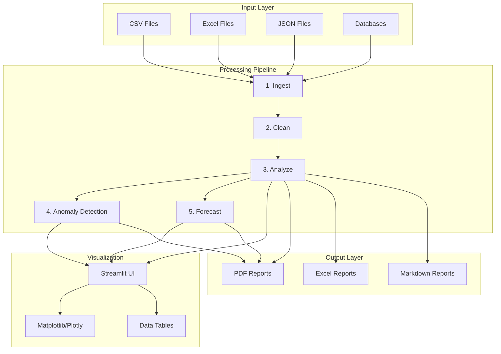
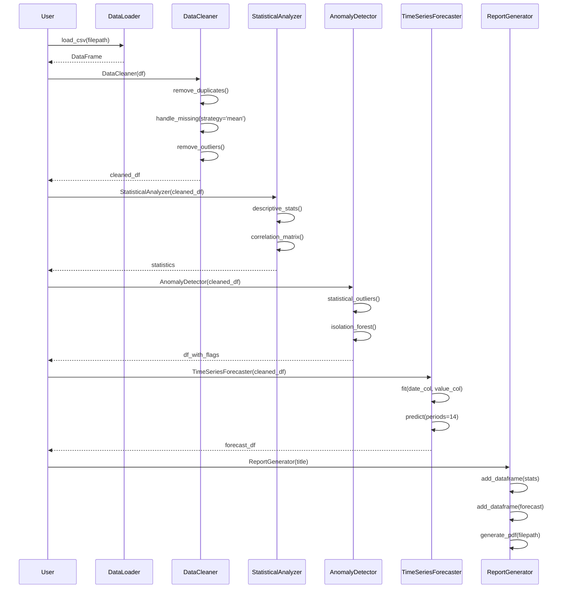
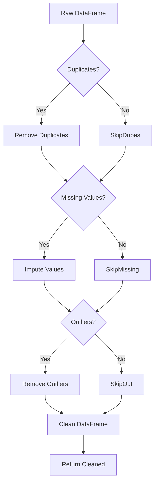
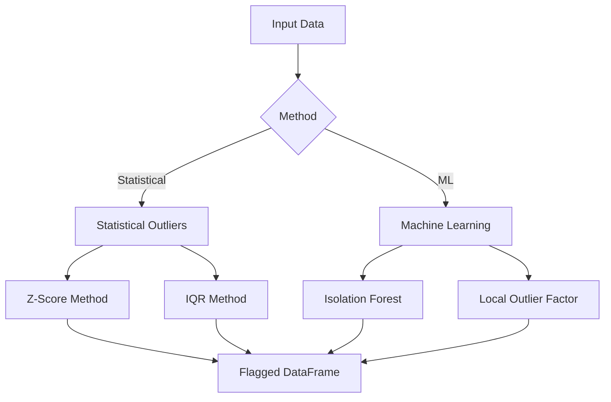
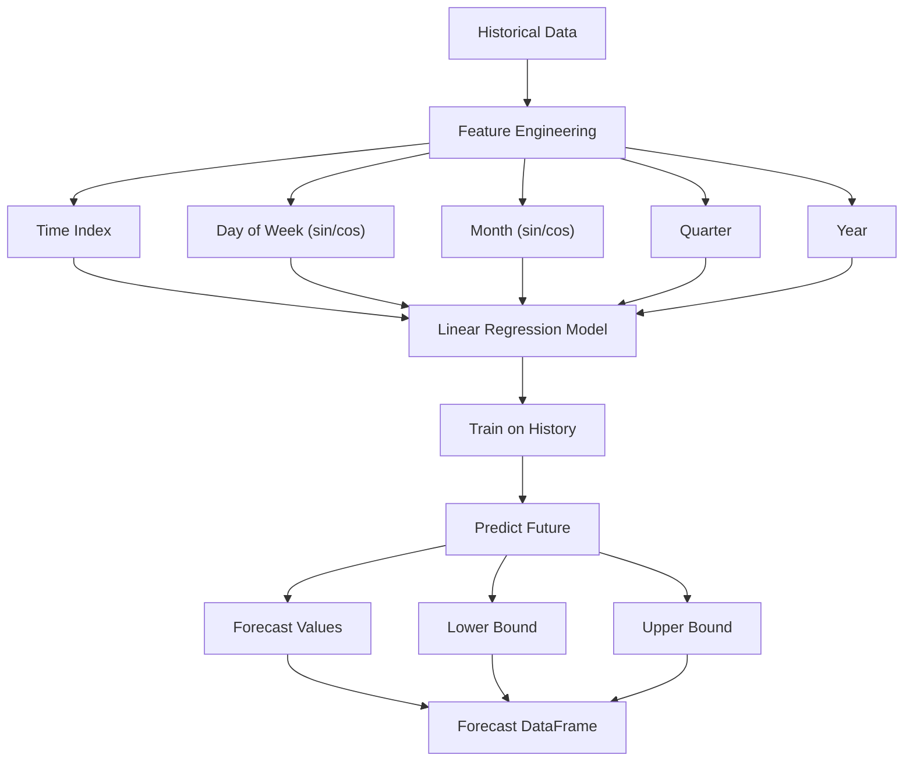
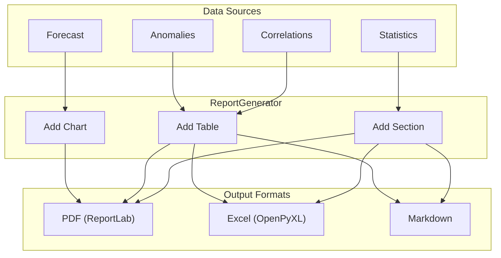
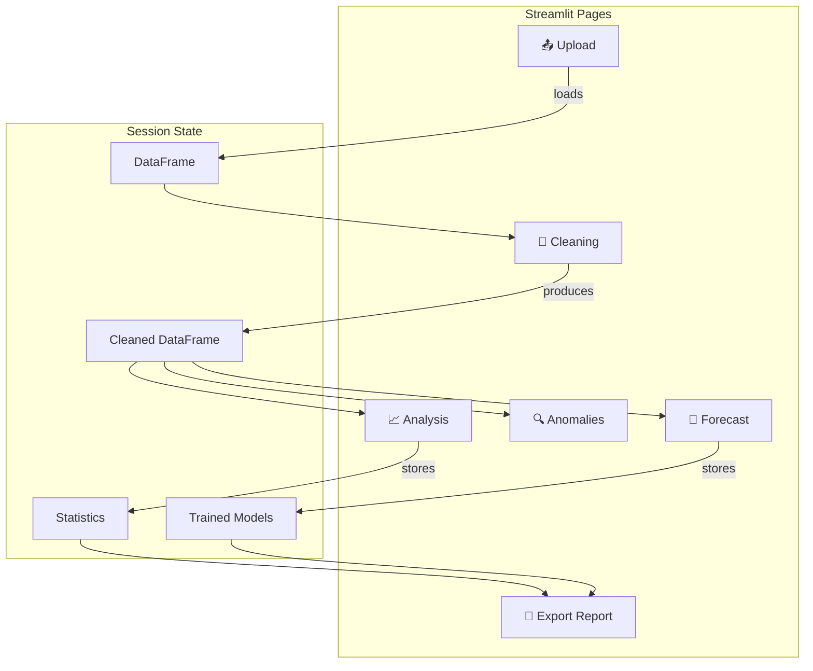

# Data Analysis Pipeline - Architecture

## System Overview

The Data Analysis & Visualization Suite is a modular analytics toolkit that automates data cleaning, analysis, anomaly detection, forecasting, and reporting.

## High-Level Architecture

## Pipeline Module Flow

## Data Cleaning Pipeline

## Anomaly Detection Methods

## Time Series Forecasting

## Report Generation Pipeline

## Streamlit App Architecture

## Technology Stack

| Layer | Technology |
|-------|------------|
| UI | Streamlit |
| Data Processing | pandas, NumPy |
| Statistics | SciPy |
| Machine Learning | scikit-learn |
| Visualization | Matplotlib, Seaborn, Plotly |
| Reports | ReportLab, OpenPyXL |
| Testing | pytest |

## Key Design Decisions

1. **Modular Pipeline**: Each stage (ingest, clean, analyze) is independent
2. **Method Chaining**: DataCleaner supports fluent interface
3. **Multiple Anomaly Methods**: Statistical and ML approaches
4. **Time Features**: Cyclical encoding for seasonality
5. **Multiple Outputs**: PDF, Excel, Markdown for different audiences
