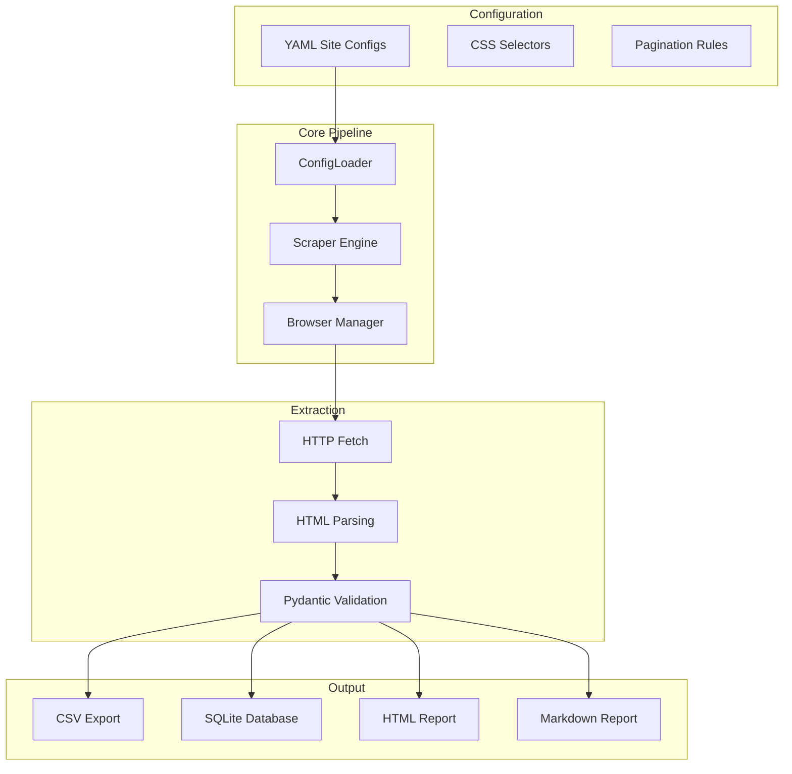
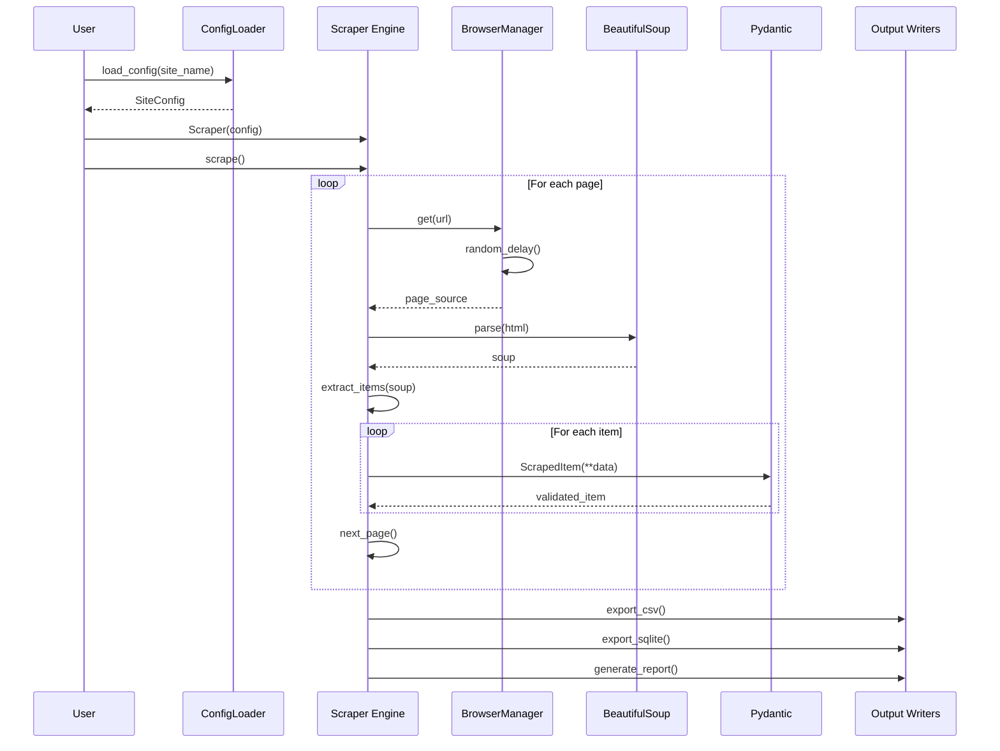
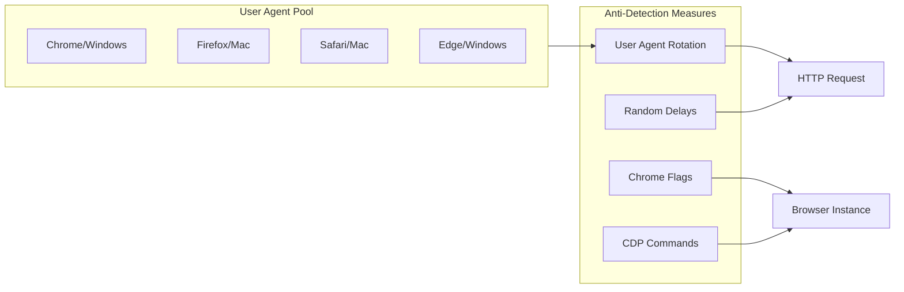
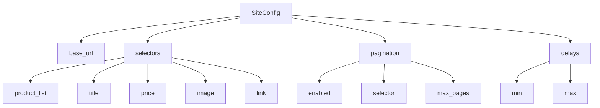
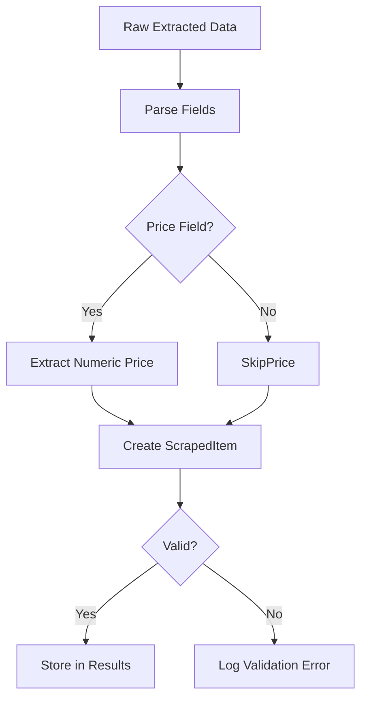
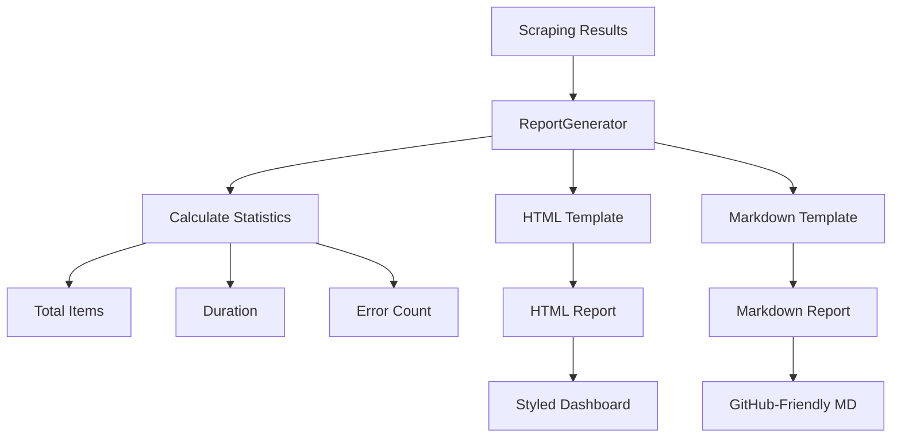
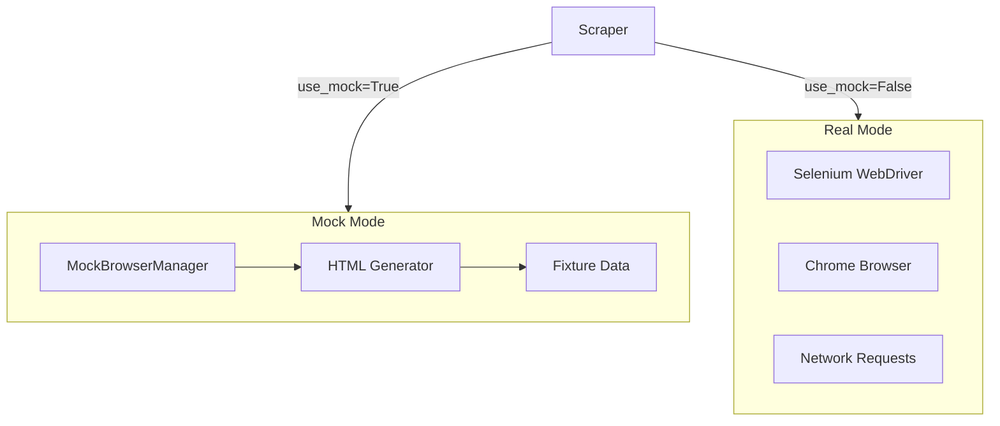

# HelioScraper Pipeline - Architecture

## System Overview

HelioScraper is a configuration-driven web scraping framework with anti-detection measures, data validation, and comprehensive reporting.

## High-Level Architecture

## Scraping Pipeline Flow

## Anti-Detection Strategy

## Configuration Structure

## Data Validation Flow

## Report Generation Pipeline

## Mock Mode Architecture

## Technology Stack

| Layer | Technology |
|-------|------------|
| Browser | Selenium 4.x |
| Parsing | BeautifulSoup 4, lxml |
| Validation | Pydantic 2.x |
| Data | pandas |
| Reports | Jinja2 |
| Config | PyYAML |
| Testing | pytest |

## Key Design Decisions

1. **YAML Configuration**: Site rules without code changes
2. **Anti-Detection**: Multiple strategies to avoid blocking
3. **Data Validation**: Pydantic ensures quality at extraction time
4. **Mock Mode**: Test without browser for rapid development
5. **Multiple Outputs**: CSV, SQLite, and reports for flexibility
