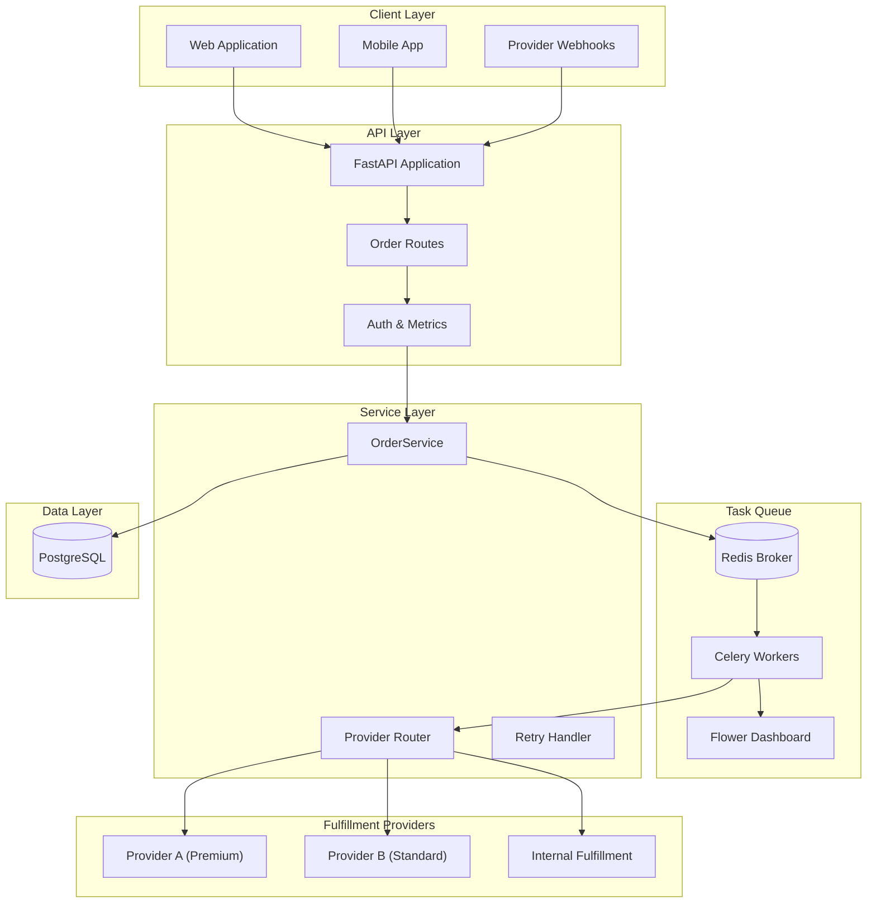
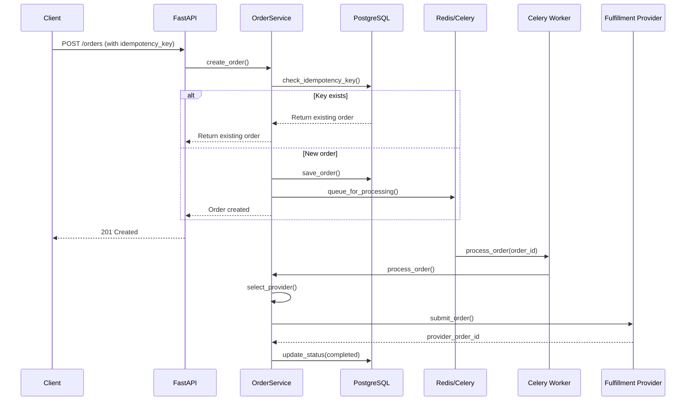
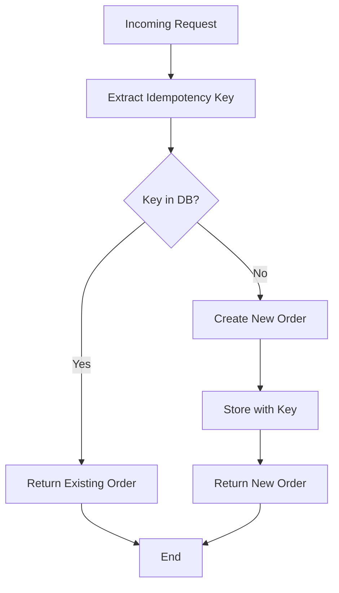
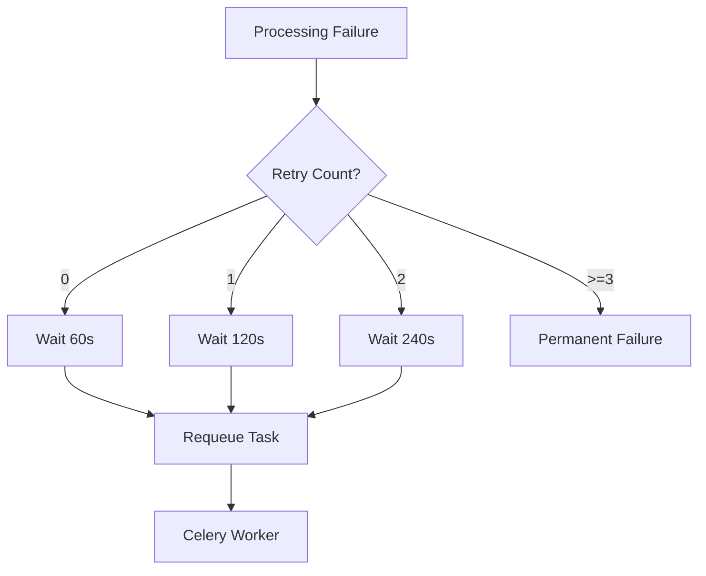
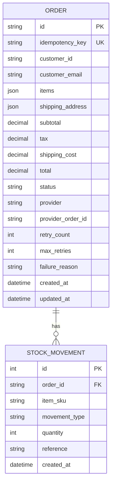

# Order Processing Automation - Architecture

## System Overview

The Order Processing Automation system is a fault-tolerant, asynchronous order pipeline that guarantees idempotent processing with intelligent provider routing.

## High-Level Architecture



## Order Processing Flow



## Provider Routing Logic

```mermaid
flowchart TD
    Start[New Order] --> CheckValue{Order Total}
    CheckValue -->|"> £500| ProviderA["Provider A<br/>Premium Fulfillment"]
    CheckValue -->|£100-500| ProviderB["Provider B<br/>Standard Fulfillment"]
    CheckValue -->|"< £100| Internal["Internal<br/>Fulfillment"]
    ProviderA --> Process[Process Order]
    ProviderB --> Process
    Internal --> Process
    Process --> Success{Success?}
    Success -->|Yes| Complete[Mark Complete]
    Success -->|No| Retry{Retry Count < 3?}
    Retry -->|Yes| Backoff[Exponential Backoff]
    Backoff --> Process
    Retry -->|No| Fail[Mark Failed]
```

## Idempotency Guarantee



## Retry Mechanism



## Database Schema



## Technology Stack

| Layer | Technology |
|-------|------------|
| API Framework | FastAPI |
| Task Queue | Celery |
| Message Broker | Redis |
| Database | PostgreSQL 16 |
| ORM | SQLAlchemy 2.0 (async) |
| Monitoring | Flower |
| Testing | pytest with async support |
| Deployment | Docker Compose |

## Key Design Decisions

1. **Idempotency Keys**: Ensure exactly-once processing even with client retries
2. **Async Task Queue**: Celery workers handle processing without blocking API
3. **Smart Routing**: Order value determines fulfillment provider
4. **Exponential Backoff**: Prevents overwhelming providers with retries
5. **Status Tracking**: Full visibility into order lifecycle
