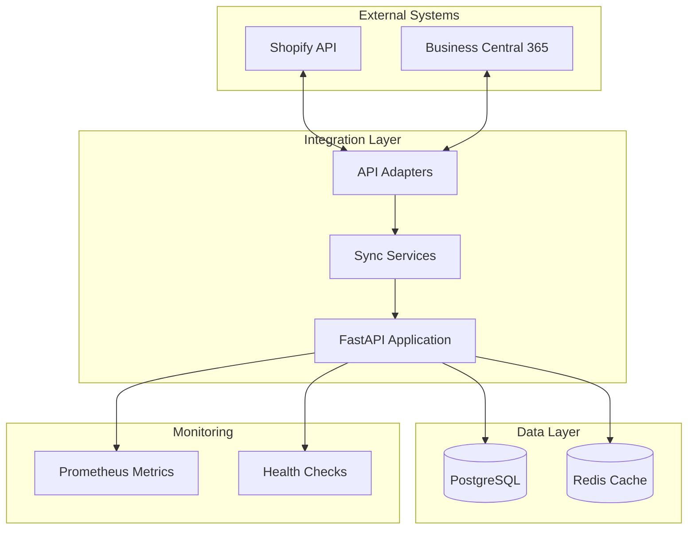
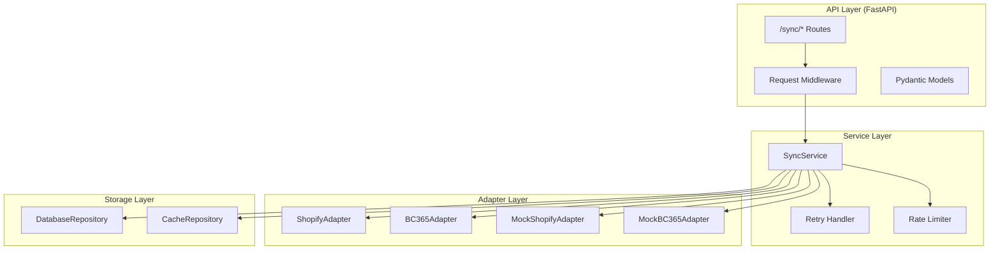
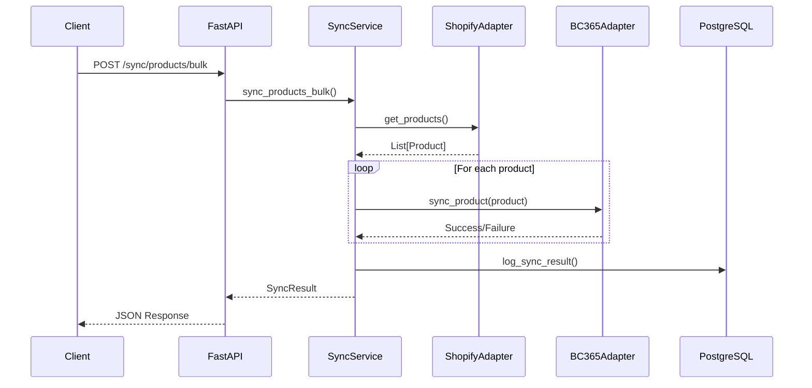
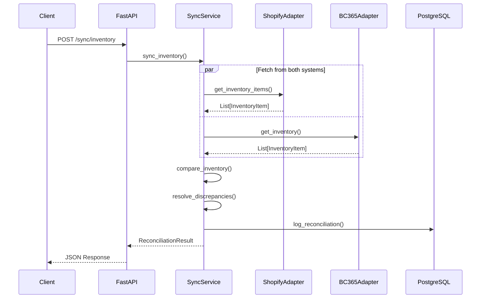
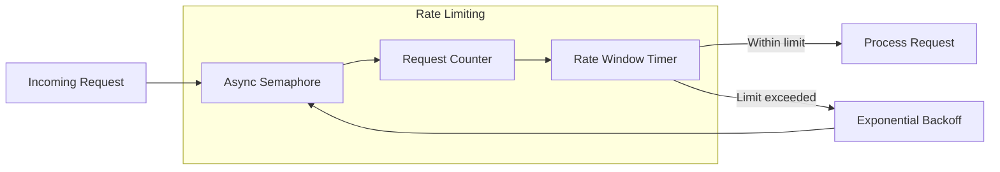
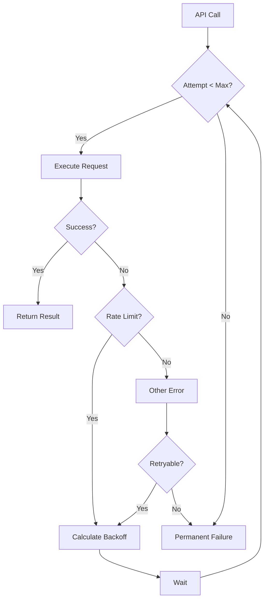

# Shopify Integration System - Architecture

## System Overview

The Shopify Integration System is a production-grade e-commerce synchronisation platform that connects Shopify storefronts with Business Central 365 ERP systems.

## High-Level Architecture

## Component Architecture

## Data Flow - Product Sync

## Data Flow - Inventory Reconciliation

## Rate Limiting Strategy

## Retry Logic Flow

## Technology Stack

| Layer | Technology |
|-------|------------|
| API Framework | FastAPI |
| Database | PostgreSQL 16 |
| ORM | SQLAlchemy 2.0 (async) |
| Cache | Redis 7 |
| Validation | Pydantic 2.x |
| Testing | pytest with async support |
| Deployment | Docker Compose |

## Key Design Decisions

1. **Adapter Pattern**: Abstracts external APIs for testability and future provider changes
2. **Mock Adapters**: Enable full offline development without credentials
3. **Async Throughout**: All I/O operations are async for performance
4. **Retry with Backoff**: Exponential backoff prevents overwhelming external APIs
5. **Idempotent Operations**: Sync operations can be safely retried
