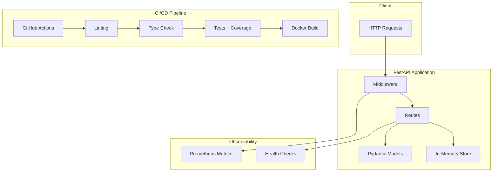

# API Docs & Testing Framework

**Production-ready API with comprehensive documentation and automated testing pipeline.**

---

## TL;DR

- Built a reference FastAPI implementation demonstrating API best practices with auto-generated OpenAPI docs
- Enforces 80%+ test coverage using pytest-cov with comprehensive unit and integration tests
- Includes GitHub Actions CI/CD pipeline with linting, type checking, testing, and Docker build

---

## Problem

API projects often suffer from:

- **Documentation drift**: Docs become outdated as code changes
- **Insufficient testing**: Manual testing misses edge cases; coverage is rarely measured
- **Inconsistent quality**: Without automated checks, code quality degrades over time
- **Deployment risks**: Broken code reaches production due to lack of CI/CD gates
- **Performance blind spots**: No visibility into request latency or error rates

---

## Solution

I built a reference API demonstrating production best practices:

**Auto-Documentation**: FastAPI generates Swagger UI and ReDoc from Pydantic models. Update the model, docs update automatically—no drift.

**Comprehensive Testing**: pytest suite covers all endpoints with both unit and integration tests. pytest-cov enforces 80%+ coverage; CI fails if threshold isn't met.

**Request Timing**: Middleware tracks request duration and exposes Prometheus metrics at `/metrics` for monitoring.

**CI/CD Pipeline**: GitHub Actions workflow runs:
1. Linting (ruff)
2. Type checking (mypy)
3. Testing with coverage (pytest)
4. Docker build verification

**Docker Ready**: Multi-stage Dockerfile produces a production-ready image (~100MB).

---

## Architecture



---

## Tech Stack

| Component | Technology |
|-----------|------------|
| Framework | FastAPI |
| Validation | Pydantic |
| Testing | pytest, pytest-cov, httpx |
| Linting | ruff |
| Type Checking | mypy |
| Metrics | Prometheus |
| CI/CD | GitHub Actions |
| Container | Docker |

---

## Key Features (Implemented)

- ✅ **Auto-Documentation**: OpenAPI/Swagger generated from code
- ✅ **Comprehensive Testing**: Unit + integration tests
- ✅ **Coverage Enforcement**: 80%+ threshold with pytest-cov
- ✅ **Request Timing**: Middleware tracks latency
- ✅ **Prometheus Metrics**: `/metrics` endpoint
- ✅ **Health Checks**: `/health` and `/ready` endpoints
- ✅ **GitHub Actions**: Full CI/CD pipeline
- ✅ **Docker Build**: Multi-stage Dockerfile

---

## Implemented vs Planned

| Implemented | Planned |
|-------------|---------|
| FastAPI service | GraphQL endpoint |
| pytest suite | Contract testing (Pact) |
| GitHub Actions | Performance benchmarks |
| Docker build | Kubernetes manifests |
| Coverage reporting | Mutation testing |

---

## How to Run Locally

```bash
# 1. Setup
cd projects/api-docs-testing-framework
python3 -m venv .venv
source .venv/bin/activate
pip install -e ".[dev]"

# 2. Run tests with coverage
pytest tests/ -v --cov=src --cov-report=html

# 3. Run demo
python scripts/run_demo.py

# 4. Start API
uvicorn api_testing.main:app --reload

# 5. View docs
open http://localhost:8000/docs  # Swagger UI
open http://localhost:8000/redoc # ReDoc
```

---

## Example Outputs

### Swagger UI
```
GET    /health          - Health check
GET    /ready           - Readiness probe
GET    /metrics         - Prometheus metrics
GET    /users           - List users
POST   /users           - Create user
GET    /users/{id}      - Get user
PUT    /users/{id}      - Update user
DELETE /users/{id}      - Delete user
GET    /items           - List items
POST   /items           - Create item
GET    /items/{id}      - Get item
PUT    /items/{id}      - Update item
DELETE /items/{id}      - Delete item
```

### Create User Request/Response
```json
POST /users
{
  "name": "Alice Smith",
  "email": "alice@example.com",
  "role": "admin"
}

Response (201):
{
  "id": "a1b2c3d4-e5f6-7890-abcd-ef1234567890",
  "name": "Alice Smith",
  "email": "alice@example.com",
  "role": "admin",
  "created_at": "2024-01-15T10:30:00"
}
```

### Coverage Report
```
Name                          Stmts   Miss  Cover
-------------------------------------------------
api_testing/main.py              85      5    94%
api_testing/models.py            32      0   100%
-------------------------------------------------
TOTAL                           117      5    96%
```

### Prometheus Metrics
```
api_requests_total{method="GET",endpoint="/users",status="200"} 42
api_request_duration_seconds_sum{method="POST",endpoint="/users"} 0.156
api_request_duration_seconds_count{method="POST",endpoint="/users"} 10
```

---

## Screenshots

| Screenshot | Description | Location |
|------------|-------------|----------|
| Swagger UI | Auto-generated API documentation | `docs/screenshots/api-testing/swagger-ui.png` |
| ReDoc | Alternative API documentation view | `docs/screenshots/api-testing/redoc.png` |
| Test Coverage | pytest-cov HTML coverage report | `docs/screenshots/api-testing/coverage-report.png` |
| Prometheus Metrics | Metrics endpoint output | `docs/screenshots/api-testing/prometheus-metrics.png` |
| GitHub Actions | CI/CD pipeline run | `docs/screenshots/api-testing/github-actions.png` |
| Docker Build | Container build verification | `docs/screenshots/api-testing/docker-build.png` |

> **Note**: Screenshots are placeholders. Generate by running the API and capturing the interfaces.

---

## What I'd Improve Next

1. **Contract Testing**: Add Pact for consumer-driven contract testing
2. **Performance Tests**: Add locust/k6 for load testing
3. **Security Scanning**: Integrate bandit and safety for vulnerability detection
4. **API Versioning**: Implement URL-based versioning (/v1/, /v2/)

---

## CV Bullets

- Built a reference FastAPI implementation with auto-generated OpenAPI documentation and comprehensive pytest suite enforcing 80%+ coverage
- Implemented request timing middleware with Prometheus metrics export for operational monitoring
- Designed GitHub Actions CI/CD pipeline with automated linting, type checking, testing, and Docker build verification

---

## LinkedIn Post

🧪 API Docs & Testing Framework—best practices in a box

Building APIs is easy. Building *good* APIs with proper docs, tests, and CI is hard.

I created a reference implementation showing how to do it right:

**Features**:
→ Auto-generated Swagger/ReDoc from Pydantic models (no doc drift)
→ 80%+ test coverage enforcement with pytest-cov
→ Request timing middleware + Prometheus metrics
→ GitHub Actions CI with lint → type check → test → Docker build

**The stack**: FastAPI, Pydantic, pytest, ruff, mypy, Prometheus, Docker

The demo creates users and items through a fully-tested CRUD API. Check the coverage report and metrics endpoint.

Use it as a template for your next API project.

Check it out in my portfolio monorepo.

#Python #FastAPI #Testing #CI/CD #API
