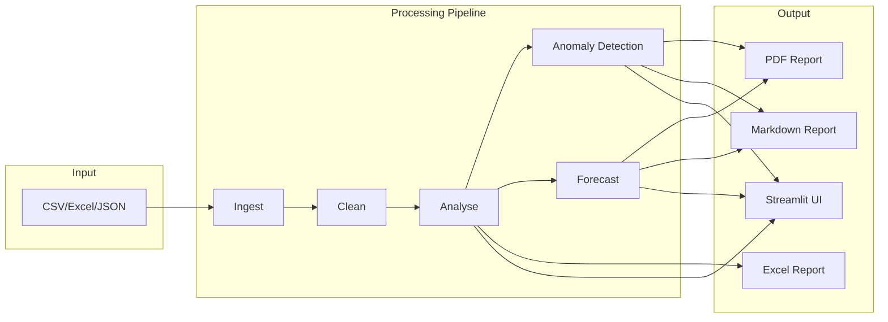

# Data Analysis & Visualisation Suite

**End-to-end analytics toolkit with automated insights and forecasting capabilities.**

---

## TL;DR

- Built a modular analytics toolkit with Streamlit interface that automates data cleaning, analysis, and reporting
- Implements anomaly detection using statistical methods (Z-score, IQR) and ML (Isolation Forest)
- Generates time series forecasts with Linear Regression and produces PDF/Excel reports

---

## Problem

Data analysts spend significant time on repetitive, error-prone tasks:

- **Data cleaning**: Handling missing values, outliers, and duplicates manually
- **Exploratory analysis**: Writing boilerplate code for statistics and correlations
- **Anomaly detection**: Spotting outliers in large datasets is time-consuming
- **Forecasting**: Building predictive models requires statistical expertise
- **Reporting**: Creating professional reports involves multiple tools

---

## Solution

I developed a modular analytics toolkit that automates the entire pipeline:

**Data Ingestion**: Supports CSV, Excel, and JSON formats with automatic type detection.

**Automated Cleaning**: Handles missing values (mean/median/median imputation), removes duplicates, and detects outliers using IQR or Z-score methods.

**Statistical Analysis**: Computes descriptive statistics, correlation matrices, and distribution analysis with skewness and kurtosis.

**Anomaly Detection**: Implements three methods:
- Statistical: Z-score and IQR-based outlier detection
- ML: Isolation Forest for multivariate anomalies
- LOF: Local Outlier Factor for density-based detection

**Time Series Forecasting**: Uses Linear Regression with time-based features (day of week, month, quarter) to generate 14-day forecasts with confidence intervals.

**Report Generation**: Produces PDF (ReportLab), Excel (OpenPyXL), and Markdown reports with a single command.

---

## Architecture



---

## Tech Stack

| Component | Technology |
|-----------|------------|
| UI | Streamlit |
| Data | pandas, NumPy |
| Analysis | SciPy |
| ML | scikit-learn |
| Viz | Matplotlib, Seaborn, Plotly |
| Reports | ReportLab, OpenPyXL |
| Testing | pytest |

---

## Key Features (Implemented)

- ✅ **Data Ingestion**: CSV, Excel, JSON support
- ✅ **Automated Cleaning**: Missing values, outliers, duplicates
- ✅ **Statistical Analysis**: Descriptive stats, correlations, distributions
- ✅ **Anomaly Detection**: Z-score, IQR, Isolation Forest, LOF
- ✅ **Time Series Forecasting**: Linear Regression with 14-day predictions
- ✅ **PDF Reports**: Styled PDF output with tables
- ✅ **Excel Reports**: Multi-sheet Excel workbooks
- ✅ **Markdown Reports**: GitHub-friendly Markdown
- ✅ **Streamlit UI**: Interactive web interface

---

## Implemented vs Planned

| Implemented | Planned |
|-------------|---------|
| Streamlit app | Jupyter notebook export |
| Data cleaning | Automated ML pipelines |
| Basic forecasting | Deep learning models (LSTM) |
| PDF/Excel reports | Scheduled report generation |

---

## How to Run Locally

```bash
# 1. Setup
cd projects/data-analysis-visualization-suite
python3 -m venv .venv
source .venv/bin/activate
pip install -e ".[dev]"

# 2. Run batch demo
python scripts/run_demo.py

# 3. Or launch interactive UI
streamlit run src/app.py

# 4. Run tests
pytest tests/ -v
```

---

## Example Outputs

### Sample Data (First 5 Rows)
```csv
date,product_id,category,sales,quantity,customer_rating,region,discount
2023-01-01,A,Electronics,1050.50,10,4,North,0
2023-01-02,B,Clothing,850.25,15,5,South,5
2023-01-03,C,Home,1200.00,8,3,East,10
2023-01-04,D,Sports,650.75,20,4,West,0
2023-01-05,E,Electronics,980.00,12,5,North,15
```

### Descriptive Statistics
```json
{
  "sales": {
    "count": 500,
    "mean": 985.42,
    "std": 185.63,
    "min": 100.50,
    "25%": 850.25,
    "50%": 980.00,
    "75%": 1100.75,
    "max": 2000.00
  }
}
```

### 7-Day Forecast
```
Date        Forecast    Lower Bound    Upper Bound
2024-01-16  1023.45     918.50        1128.40
2024-01-17   987.32     882.40        1092.24
2024-01-18  1056.78     951.80        1161.76
2024-01-19   934.21     829.30        1039.12
2024-01-20  1089.56     984.60        1194.52
2024-01-21  1012.34     907.40        1117.28
2024-01-22   967.89     862.90        1072.88
```

---

## Screenshots

| Screenshot | Description | Location |
|------------|-------------|----------|
| Streamlit UI | Main dashboard with data upload and analysis options | `docs/screenshots/data-analysis/streamlit-ui.png` |
| Data Cleaning | Missing values and outlier detection interface | `docs/screenshots/data-analysis/data-cleaning.png` |
| Anomaly Detection | Isolation Forest results visualization | `docs/screenshots/data-analysis/anomaly-detection.png` |
| Forecast Chart | Time series forecast with confidence intervals | `docs/screenshots/data-analysis/forecast-chart.png` |
| PDF Report | Generated PDF report sample | `docs/screenshots/data-analysis/pdf-report.png` |
| Excel Export | Multi-sheet Excel workbook output | `docs/screenshots/data-analysis/excel-export.png` |

> **Note**: Screenshots are placeholders. Generate by running `streamlit run src/app.py` and capturing the UI.

---

## What I'd Improve Next

1. **Deep Learning**: Add LSTM/Prophet for more accurate time series forecasting
2. **AutoML**: Automated model selection and hyperparameter tuning
3. **Data Connectors**: Direct connections to PostgreSQL, BigQuery, Snowflake
4. **Collaboration**: Multi-user support with shared workspaces

---

## CV Bullets

- Developed a modular analytics toolkit using Streamlit, pandas, and scikit-learn automating data cleaning, anomaly detection, and time series forecasting
- Implemented multiple anomaly detection methods (Z-score, Isolation Forest, LOF) identifying outliers in 500-record demo datasets
- Generated automated PDF, Excel, and Markdown reports reducing manual reporting effort

---

## LinkedIn Post

📊 Data Analysis & Visualisation Suite

Tired of writing the same pandas boilerplate for every analysis? I built a toolkit that automates the entire pipeline.

**What it does**:
→ Ingests CSV/Excel and auto-cleans (missing values, outliers, duplicates)
→ Runs statistical analysis and correlation matrices
→ Detects anomalies using Z-score, IQR, and Isolation Forest
→ Forecasts trends with Linear Regression + confidence intervals
→ Generates PDF, Excel, and Markdown reports

**Two ways to use it**:
1. Batch: `python scripts/run_demo.py`
2. Interactive: `streamlit run src/app.py`

**Tech stack**: Streamlit, pandas, scikit-learn, SciPy, ReportLab

The demo processes 500 rows through the full pipeline and spits out forecasts and professional reports. Perfect for analysts who want to skip the boilerplate.

Check it out in my portfolio monorepo.

#Python #DataAnalysis #MachineLearning #Streamlit #DataScience
