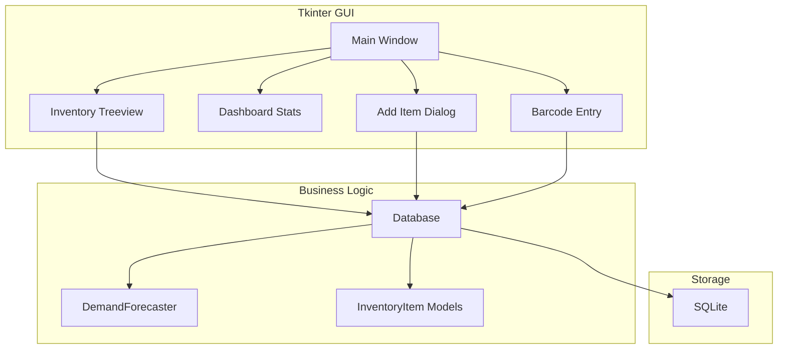

# Digital Inventory Management

**Desktop inventory system with demand forecasting for restaurant operations.**

---

## TL;DR

- Built a Tkinter-based desktop application for restaurant inventory management with SQLite storage
- Implements demand forecasting using Linear Regression to predict optimal reorder points
- Includes barcode scan simulation, low stock alerts, and CSV export functionality

---

## Problem

Restaurants face unique inventory challenges:

- **Perishable goods**: Items expire quickly; waste is costly
- **Unpredictable demand**: Daily customer counts vary; stockouts disappoint customers
- **Manual tracking**: Spreadsheets are error-prone and don't provide insights
- **No forecasting**: Ordering is reactive, not predictive
- **Limited tech**: Kitchen staff need simple, reliable tools—not complex web apps

---

## Solution

I built a desktop application designed for restaurant environments:

**Stock Management**: Track items by SKU with quantities, units, locations, and reorder levels. Visual indicators show low stock items.

**Movement Tracking**: Log all stock in/out transactions with timestamps and references (PO numbers, invoices).

**Expiration Alerts**: Track expiry dates and alert on items nearing expiration (planned feature—database schema ready).

**Waste Tracking**: Record waste with reasons (expired, damaged, spoiled) to identify patterns.

**Demand Forecasting**: Uses scikit-learn Linear Regression with time-based features to generate 14-day demand forecasts and calculate optimal reorder points with safety stock.

**Barcode Scanning**: Simulated scanner input—type a SKU and press Enter for instant lookup.

**CSV Export**: One-click export of inventory data for external reporting.

---

## Architecture



---

## Tech Stack

| Component | Technology |
|-----------|------------|
| GUI | Tkinter |
| Database | SQLite |
| Data | pandas |
| ML | scikit-learn |
| Viz | Matplotlib |
| Testing | pytest |

---

## Key Features (Implemented)

- ✅ **Stock Management**: Track items, quantities, locations
- ✅ **Movement Tracking**: Log stock in/out transactions
- ✅ **Expiration Alerts**: Database schema ready (UI planned)
- ✅ **Waste Tracking**: Record waste with reasons
- ✅ **Reorder Alerts**: Visual indicators for low stock
- ✅ **Demand Forecasting**: Linear Regression with 14-day predictions
- ✅ **Barcode Scanning**: Simulated scanner input
- ✅ **CSV Export**: Export inventory data

---

## Implemented vs Planned

| Implemented | Planned |
|-------------|---------|
| Tkinter GUI | Web-based version |
| SQLite storage | Cloud sync |
| Basic forecasting | Advanced time series (ARIMA, Prophet) |
| Barcode simulation | Hardware scanner support |
| Waste tracking | Supplier integration |

---

## How to Run Locally

```bash
# 1. Setup
cd projects/digital-inventory-management
python3 -m venv .venv
source .venv/bin/activate
pip install -e ".[dev]"

# 2. Run CLI demo
python scripts/run_demo.py

# 3. Or launch GUI
python src/main.py

# 4. Run tests
pytest tests/ -v
```

---

## Example Outputs

### Sample Inventory Items
```
SKU        Name                      Category    Qty    Unit    Reorder
FLOUR001   All-Purpose Flour         Baking      50     kg      20
SUGAR001   Granulated Sugar          Baking      30     kg      15
OIL001     Vegetable Oil             Cooking     20     L       10
RICE001    Basmati Rice              Grains      40     kg      20
PASTA001   Spaghetti                 Pasta       25     kg      15
TOM001     Canned Tomatoes           Canned      60     cans    30
CHEESE001  Mozzarella Cheese         Dairy       15     kg      8
CHICKEN001 Chicken Breast            Meat        20     kg      10
BEEF001    Ground Beef               Meat        18     kg      10
SALT001    Sea Salt                  Spices      10     kg      5
```

### Inventory Statistics
```json
{
  "total_items": 10,
  "total_quantity": 288,
  "total_value": 1250.75,
  "low_stock_count": 2,
  "category_count": 7
}
```

### Reorder Point Calculation
```
Item: FLOUR001 (All-Purpose Flour)
Average daily demand: 2.5 kg
Demand std dev: 0.8 kg
Lead time: 7 days
Lead time demand: 17.5 kg
Safety stock: 3.9 kg
Recommended reorder point: 21.4 kg
```

### 7-Day Forecast
```
Date        Forecast (kg)
2024-01-16  2.3
2024-01-17  2.8
2024-01-18  2.1
2024-01-19  3.2
2024-01-20  2.9
2024-01-21  3.5
2024-01-22  2.6
```

---

## Screenshots

| Screenshot | Description | Location |
|------------|-------------|----------|
| Main Window | Tkinter main inventory view | `docs/screenshots/inventory/main-window.png` |
| Dashboard | Statistics and low stock alerts | `docs/screenshots/inventory/dashboard.png` |
| Add Item Dialog | Form for adding new inventory items | `docs/screenshots/inventory/add-item-dialog.png` |
| Barcode Scan | Simulated barcode scanner input | `docs/screenshots/inventory/barcode-scan.png` |
| Forecast Chart | 14-day demand forecast visualization | `docs/screenshots/inventory/forecast-chart.png` |
| CSV Export | Exported inventory data | `docs/screenshots/inventory/csv-export.png` |

> **Note**: Screenshots are placeholders. Generate by running `python src/main.py` and capturing the GUI.

---

## What I'd Improve Next

1. **Web Version**: Build a web-based version for multi-device access
2. **Mobile App**: Add Android/iOS app for kitchen staff
3. **Supplier Integration**: Connect to supplier APIs for automated ordering
4. **Advanced Forecasting**: Implement ARIMA or Prophet for better accuracy

---

## CV Bullets

- Developed a Tkinter-based desktop inventory management application with SQLite storage and demand forecasting for restaurant operations
- Implemented demand prediction using scikit-learn Linear Regression calculating optimal reorder points with safety stock
- Designed barcode scan simulation and CSV export functionality for operational efficiency

---

## LinkedIn Post

🍽️ Digital Inventory Management—for restaurants, not warehouses

Most inventory systems are built for warehouses, not kitchens. I built one that understands perishable goods and unpredictable demand.

**What it does**:
→ Tracks stock with reorder alerts
→ Forecasts demand using Linear Regression
→ Calculates optimal reorder points with safety stock
→ Simulates barcode scanning for quick lookup
→ Exports to CSV for reporting

**Two modes**:
1. CLI demo: `python scripts/run_demo.py`
2. GUI: `python src/main.py`

**Tech stack**: Tkinter, SQLite, pandas, scikit-learn

The demo includes 10 sample items (flour, sugar, oil, etc.) and generates 14-day forecasts. Perfect for small restaurants that need forecasting without enterprise complexity.

Check it out in my portfolio monorepo.

#Python #Tkinter #InventoryManagement #MachineLearning #Restaurants
