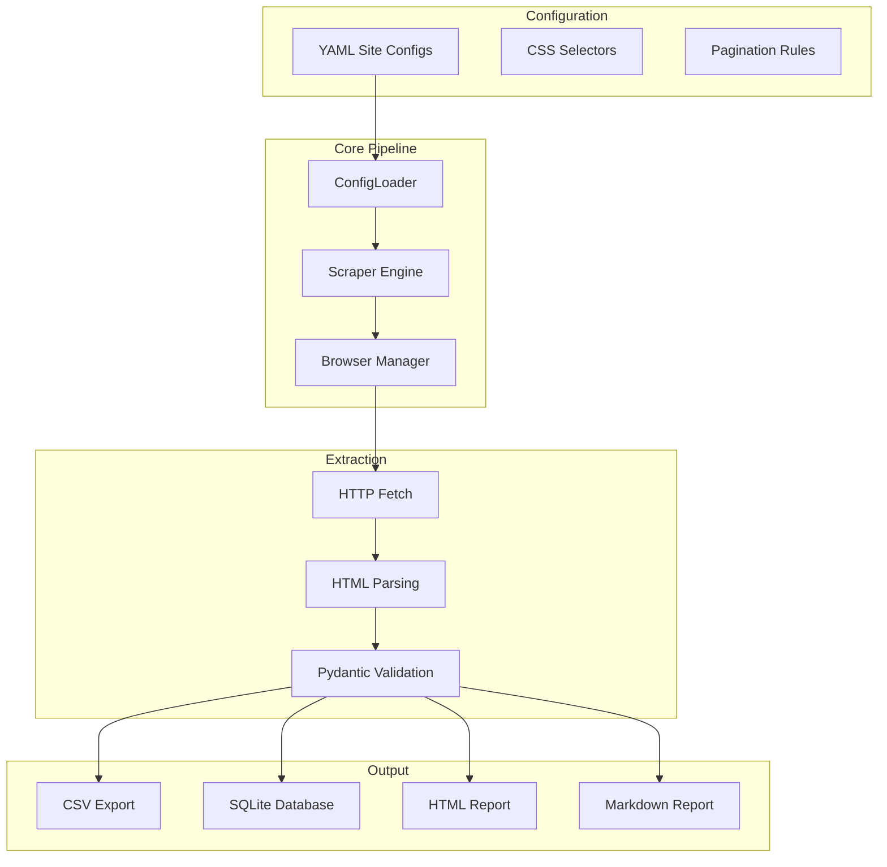
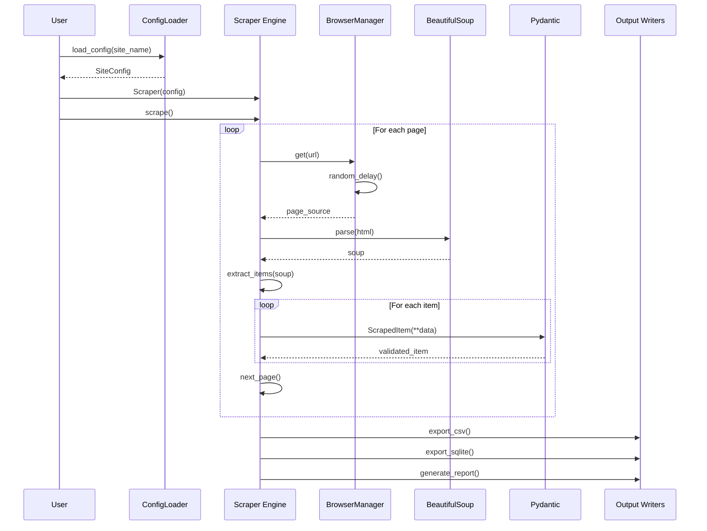

# HelioScraper

**Configurable web scraping framework with intelligent anti-detection and comprehensive reporting.**

---

## TL;DR

- Built a YAML-configurable scraping framework using Selenium that defines site rules without code changes
- Implements rotating user agents, randomized delays, and anti-detection measures to avoid blocking
- Generates professional HTML/Markdown audit reports with extraction statistics

---

## System Architecture



---

## Problem

Data extraction from websites presents several recurring challenges:

- **Anti-bot measures**: Sites detect and block automated browsers using fingerprinting and behaviour analysis
- **Maintenance overhead**: When site structures change, scrapers break and require code updates
- **Data quality**: Extracted data often contains inconsistencies that aren't caught until downstream
- **Audit requirements**: Compliance and debugging need records of what was extracted and when
- **Development friction**: Testing scrapers requires running real browsers, slowing iteration

---

## Solution

I created a configuration-driven scraping framework that separates extraction rules from implementation:

**YAML Configuration**: Site-specific rules (selectors, pagination, delays) live in YAML files. When a site changes, you update the config—not the code.

**Anti-Detection**: Rotates through 5 real user agents, adds random delays (1-3s default), and uses headless Chrome with `--disable-blink-features=AutomationControlled` to avoid detection.

**Data Validation**: Pydantic models validate extracted items at runtime, catching type mismatches and missing fields immediately.

**Comprehensive Reporting**: Generates both HTML (styled dashboard) and Markdown reports showing extraction statistics, sample data, and errors.

**Mock Mode**: A MockBrowserManager generates realistic HTML without Selenium, enabling rapid development without Chrome.

---

## Architecture

### Scraping Pipeline Flow



---

## Tech Stack

| Component | Technology |
|-----------|------------|
| Browser | Selenium (Chrome) |
| Parsing | BeautifulSoup, lxml |
| Validation | Pydantic |
| Data | pandas |
| Reports | Jinja2 |
| Config | PyYAML |
| Testing | pytest |

---

## Key Features (Implemented)

- ✅ **YAML Configuration**: Site rules in `configs/sites/*.yml`—no code changes needed
- ✅ **User Agent Rotation**: 5 real browser UAs rotated per request
- ✅ **Randomized Delays**: Configurable min/max delays between requests (default 1-3s)
- ✅ **Anti-Detection**: Chrome flags to prevent automation detection
- ✅ **Data Validation**: Pydantic models ensure data integrity
- ✅ **Multiple Outputs**: CSV, SQLite database
- ✅ **Audit Reports**: HTML and Markdown reports with statistics
- ✅ **Mock Mode**: Test without Chrome using MockBrowserManager

---

## Implemented vs Planned

| Implemented | Planned |
|-------------|---------|
| Selenium scraper | Playwright support |
| YAML configs | Visual config builder |
| CSV/SQLite output | S3/cloud storage |
| HTML reports | Real-time monitoring dashboard |
| User agent rotation | CAPTCHA solving integration |

---

## How to Run Locally

```bash
# 1. Setup
cd projects/helioscraper
python3 -m venv .venv
source .venv/bin/activate
pip install -e ".[dev]"

# 2. Run demo (mock mode—no Chrome needed)
python scripts/run_demo.py

# 3. Run tests
pytest tests/ -v
```

---

## Example Outputs

### YAML Configuration
```yaml
name: Demo E-commerce Site
base_url: https://example-ecommerce.com/products
selectors:
  product_list: .product-card
  title: .product-title
  price: .product-price
  image: .product-image@src
  link: .product-link@href
pagination:
  enabled: true
  max_pages: 5
delays:
  min: 1.0
  max: 3.0
user_agent_rotation: true
max_pages: 3
```

### Scraping Result
```json
{
  "site_name": "Demo E-commerce Site",
  "total_items": 23,
  "total_pages": 3,
  "duration_seconds": 0.45,
  "success_rate": 100.0,
  "errors": []
}
```

### Sample Extracted Item
```json
{
  "url": "https://example-ecommerce.com/product/123",
  "title": "Mock Product 456",
  "price": 89.99,
  "currency": "USD",
  "image_url": "https://example.com/image456.jpg",
  "scraped_at": "2024-01-15T10:30:00"
}
```

---

## Screenshot Placeholders

| Screenshot | Description | Filename |
|------------|-------------|----------|
| Report Dashboard | HTML scraping report overview | `helioscraper-report.png` |
| YAML Config | Site configuration example | `helioscraper-config.png` |
| CSV Output | Extracted data in CSV format | `helioscraper-csv.png` |
| SQLite Browser | Database view of scraped data | `helioscraper-sqlite.png` |
| Terminal Output | Console output from demo | `helioscraper-terminal.png` |

---

## What I'd Improve Next

1. **Playwright Support**: Add Playwright as an alternative to Selenium for better performance
2. **Distributed Scraping**: Implement Selenium Grid support for parallel extraction
3. **JavaScript Rendering**: Better handling of SPAs with dynamic content loading
4. **Cloud Storage**: Direct upload to S3/Azure Blob for large datasets

---

## CV Bullets

- Developed a YAML-configurable web scraping framework using Selenium with rotating user agents and randomized delays to avoid anti-bot detection
- Implemented Pydantic data validation ensuring extracted data quality with immediate error detection
- Generated automated HTML/Markdown audit reports providing extraction statistics and traceability

---

## LinkedIn Post

🕷️ Released HelioScraper—my configurable web scraping framework

Web scraping shouldn't require rewriting code every time a site changes structure. I built HelioScraper to solve this.

**What it does**:
→ Define scraping rules in YAML—no code changes when sites update
→ Rotates user agents and adds random delays to avoid blocking
→ Validates extracted data with Pydantic models
→ Generates professional HTML/Markdown reports

**Key feature**: Mock browser mode lets you develop and test without Chrome running.

**Tech stack**: Selenium, Pydantic, BeautifulSoup, pandas, Jinja2

The demo generates realistic fixture data and exports to CSV, SQLite, and formatted reports. Perfect for data extraction pipelines.

Check it out in my portfolio monorepo.

#Python #WebScraping #DataExtraction #Selenium #Automation
