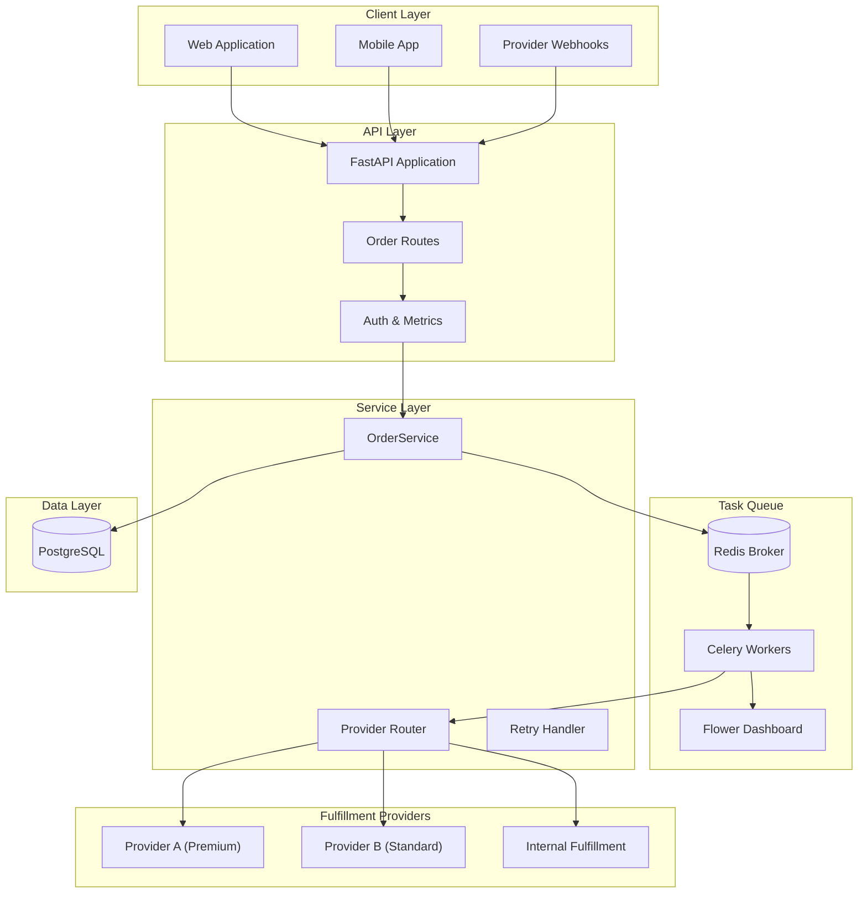
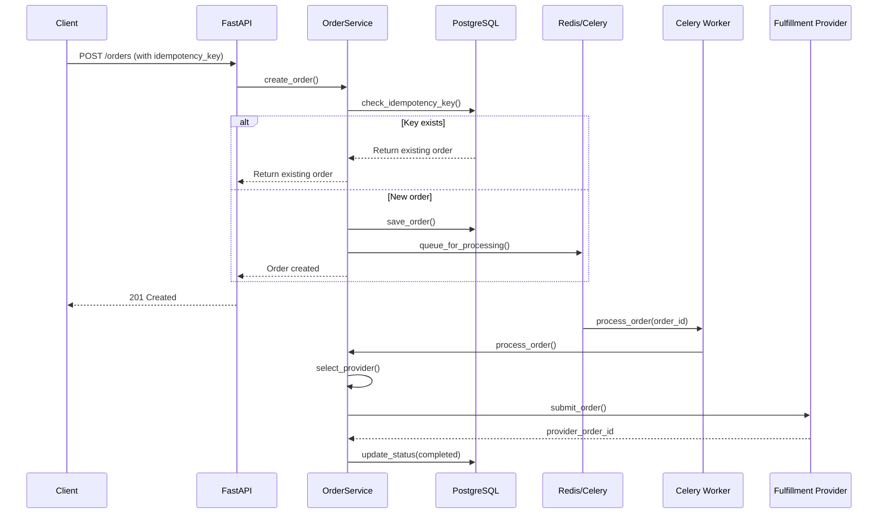

# Order Processing Automation

**Asynchronous order pipeline with idempotency guarantees and intelligent provider routing.**

---

## TL;DR

- Built an async order processing pipeline using FastAPI and Celery that guarantees exactly-once processing via idempotency keys
- Implements intelligent provider routing based on order value (high → Provider A, medium → Provider B, low → internal)
- Includes automatic retry with exponential backoff and a dashboard metrics endpoint

---

## System Architecture



---

## Problem

E-commerce order processing faces several reliability challenges:

- **Duplicate processing**: Network timeouts cause clients to retry, leading to duplicate orders and charges
- **Provider selection**: Different fulfillment providers suit different order types, but routing logic is often hardcoded
- **Failure recovery**: When processing fails, orders get stuck without clear retry mechanisms
- **Visibility**: Operations teams lack real-time insight into processing status and bottlenecks
- **Scale**: Synchronous processing blocks during peak loads

---

## Solution

I built a fault-tolerant order pipeline using FastAPI and Celery:

**Idempotency Guarantee**: Each order includes an idempotency key. The system checks for existing keys before processing, ensuring exactly-once semantics even with client retries.

**Smart Routing**: Orders are routed based on total value:
- Orders > £500 → Provider A (premium fulfillment)
- Orders £100-500 → Provider B (standard fulfillment)
- Orders < £100 → Internal processing

**Retry Logic**: Failed orders automatically retry up to 3 times with exponential backoff (60s, 120s, 240s). Permanent failures are flagged for manual review.

**Real-time Tracking**: Job status is tracked through the pipeline (pending → validating → processing → completed/failed) with timestamps.

**Dashboard Metrics**: `GET /dashboard/metrics` returns order counts by status, success rates, and provider distribution.

---

## Architecture

### Order Processing Flow



### Provider Routing Logic

```mermaid
flowchart TD
    Start[New Order] --> CheckValue{Order Total}
    CheckValue -->|"> £500| ProviderA["Provider A<br/>Premium Fulfillment"]
    CheckValue -->|£100-500| ProviderB["Provider B<br/>Standard Fulfillment"]
    CheckValue -->|"< £100| Internal["Internal<br/>Fulfillment"]
    ProviderA --> Process[Process Order]
    ProviderB --> Process
    Internal --> Process
    Process --> Success{Success?}
    Success -->|Yes| Complete[Mark Complete]
    Success -->|No| Retry{Retry Count < 3?}
    Retry -->|Yes| Backoff[Exponential Backoff]
    Backoff --> Process
    Retry -->|No| Fail[Mark Failed]
```

---

## Tech Stack

| Component | Technology |
|-----------|------------|
| Framework | FastAPI |
| Task Queue | Celery |
| Message Broker | Redis |
| Database | PostgreSQL |
| ORM | SQLAlchemy (async) |
| Monitoring | Flower |
| Testing | pytest with async support |
| Deployment | Docker Compose |

---

## Key Features (Implemented)

- ✅ **Async Processing**: Celery workers handle orders asynchronously
- ✅ **Idempotency Keys**: Guarantees exactly-once processing
- ✅ **Job Tracking**: Real-time status updates (pending → processing → completed)
- ✅ **Provider Routing**: Rule-based order distribution by value
- ✅ **Retry Logic**: Automatic retry with exponential backoff (max 3 attempts)
- ✅ **Failure Recovery**: Retry endpoint for manual reprocessing
- ✅ **Webhook Integration**: `POST /webhooks/provider-status` for provider updates
- ✅ **Dashboard Metrics**: Order counts, success rates, provider distribution

---

## Implemented vs Planned

| Implemented | Planned |
|-------------|---------|
| Async order processing | Saga pattern implementation |
| Idempotency keys | Multi-region deployment |
| Provider routing | ML-based provider selection |
| Retry logic | Dead letter queue |
| Webhook handlers | Event sourcing |

---

## How to Run Locally

```bash
# 1. Setup
cd projects/order-processing-automation
python3 -m venv .venv
source .venv/bin/activate
pip install -e ".[dev]"

# 2. Start services (PostgreSQL + Redis + Celery)
docker-compose up -d

# 3. Run demo
python scripts/run_demo.py

# 4. View Celery tasks (optional)
open http://localhost:5555  # Flower dashboard

# 5. Run tests
pytest tests/ -v
```

---

## Example Outputs

### Create Order Request
```json
POST /orders
{
  "idempotency_key": "order-123-unique",
  "customer_id": "cust_456",
  "customer_email": "customer@example.com",
  "items": [
    {
      "product_id": "prod_789",
      "sku": "SKU-001",
      "name": "Widget",
      "quantity": 2,
      "unit_price": 150.00,
      "total_price": 300.00
    }
  ],
  "shipping_address": {
    "name": "John Doe",
    "line1": "123 Main St",
    "city": "London",
    "state": "England",
    "postal_code": "SW1A 1AA",
    "country": "UK"
  },
  "subtotal": 300.00,
  "tax": 60.00,
  "shipping_cost": 15.00,
  "total": 375.00
}
```

### Create Order Response
```json
{
  "order_id": "a1b2c3d4-e5f6-7890-abcd-ef1234567890",
  "idempotency_key": "order-123-unique",
  "status": "pending",
  "message": "Order submitted for processing"
}
```

### Dashboard Metrics
```json
{
  "total_orders": 5,
  "pending_orders": 0,
  "processing_orders": 0,
  "completed_orders": 5,
  "failed_orders": 0,
  "retrying_orders": 0,
  "success_rate_percent": 100.0,
  "provider_distribution": {
    "provider_a": 2,
    "provider_b": 1,
    "internal": 2
  },
  "generated_at": "2024-01-15T10:30:00"
}
```

---

## Screenshot Placeholders

| Screenshot | Description | Filename |
|------------|-------------|----------|
| Order Creation | API response for new order | `orders-create.png` |
| Dashboard Metrics | Processing statistics view | `orders-metrics.png` |
| Provider Routing | Logic visualization | `orders-routing.png` |
| Flower Dashboard | Celery task monitoring | `orders-flower.png` |
| Swagger UI | API documentation | `orders-swagger.png` |

---

## What I'd Improve Next

1. **Saga Pattern**: Implement distributed transactions for multi-step order processing with compensation
2. **Dead Letter Queue**: Route permanently failed orders to DLQ for analysis
3. **Event Sourcing**: Store events instead of state for full audit trails
4. **ML Routing**: Use historical data to optimise provider selection

---

## CV Bullets

- Architected an asynchronous order processing pipeline using FastAPI and Celery with idempotency guarantees preventing duplicate order creation
- Implemented intelligent provider routing based on order value, distributing load across premium and standard fulfillment partners
- Built automatic retry mechanism with exponential backoff and dashboard metrics for operational visibility

---

## LinkedIn Post

⚡ Order Processing Automation—built for reliability at scale

The hardest part of e-commerce isn't taking orders—it's processing them reliably when networks fail, clients retry, and providers go down.

**What I built**:
→ Async pipeline with Celery workers
→ Idempotency keys for exactly-once processing guarantee
→ Smart routing (high-value → premium provider, low-value → internal)
→ Automatic retry with exponential backoff
→ Dashboard metrics for ops visibility

**Tech stack**: FastAPI, PostgreSQL, Redis, Celery, Pydantic, Docker

The demo creates 5 sample orders and routes them based on value. You can watch them flow through pending → processing → completed in real-time.

Check it out in my portfolio monorepo.

#Python #FastAPI #Celery #DistributedSystems #Ecommerce
