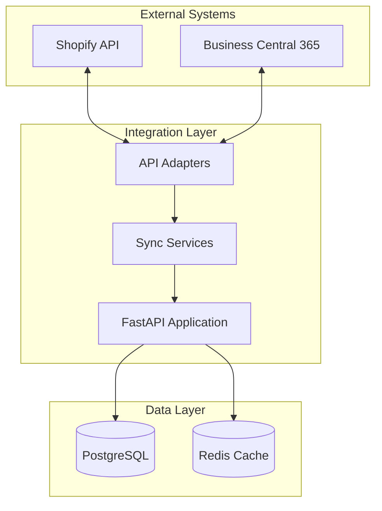
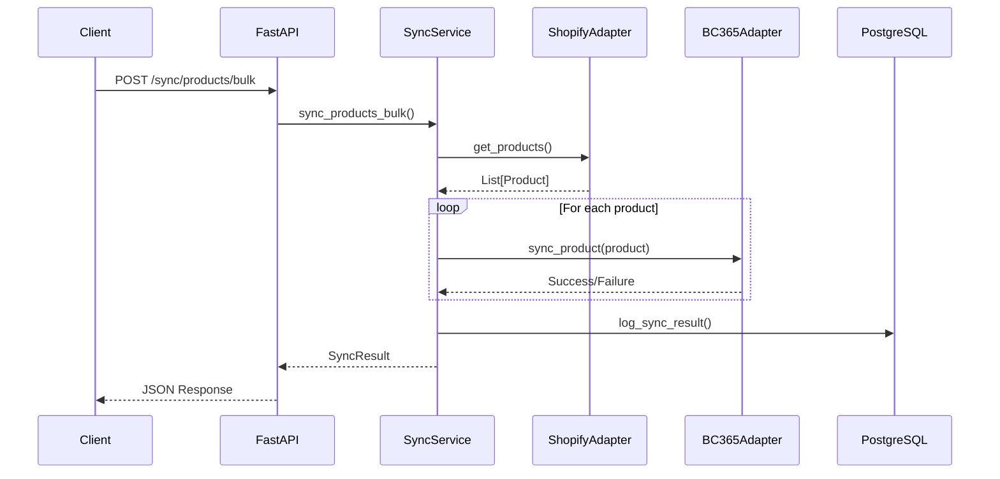

# Shopify Integration System

**Enterprise-grade e-commerce synchronisation with intelligent rate limiting and data reconciliation.**

---

## TL;DR

- Built a resilient FastAPI integration platform that handles Shopify API rate limits with automatic retry logic and exponential backoff
- Implements automated inventory reconciliation that detects and resolves discrepancies between Shopify and Business Central 365
- Includes mock adapters for full functionality without real credentials—demo runs entirely offline

---

## System Architecture



---

## Problem

E-commerce businesses operating Shopify storefronts alongside back-office ERP systems face significant data synchronisation challenges:

- **API rate limits**: Shopify enforces strict request limits (40 requests per second for standard plans), causing failures without proper handling
- **Data drift**: Inventory levels, product details, and order statuses become inconsistent between systems over time
- **Manual reconciliation**: Teams spend hours manually comparing spreadsheets to identify discrepancies
- **Failed syncs without recovery**: Network blips or API errors leave data permanently out of sync
- **Testing difficulties**: Developers need live credentials and test stores, slowing development

---

## Solution

I built a production-ready integration platform using FastAPI that addresses each challenge systematically:

**Rate Limit Handling**: Implements semaphore-based request throttling with configurable limits. When rate limits are hit, the system backs off exponentially (1s, 2s, 4s, 8s...) before retrying.

**Automated Reconciliation**: Fetches inventory from both Shopify and BC365, compares SKU-by-SKU, identifies discrepancies, and generates reports showing exactly what needs correction.

**Mock Adapters**: Both Shopify and BC365 adapters have mock implementations that generate realistic fixture data. This means the entire demo runs without any real credentials or external dependencies.

**Batch Processing**: Bulk operations process records in configurable batches (default 100), reducing API call overhead and improving throughput.

---

## Architecture

The architecture follows clean separation of concerns:
- **API Layer**: FastAPI routes handle HTTP requests and responses
- **Service Layer**: SyncService orchestrates operations and implements retry logic
- **Adapter Layer**: Abstracts external APIs; mock implementations enable offline testing
- **Storage Layer**: PostgreSQL for persistent data, Redis for caching and rate limiting

### Data Flow - Product Sync



---

## Tech Stack

| Component | Technology |
|-----------|------------|
| Framework | FastAPI |
| Database | PostgreSQL |
| ORM | SQLAlchemy (async) |
| Cache | Redis |
| Validation | Pydantic |
| Testing | pytest with async support |
| Deployment | Docker Compose |

---

## Key Features (Implemented)

- ✅ **Bulk Product Sync**: `POST /sync/products/bulk` processes products in configurable batches
- ✅ **Inventory Reconciliation**: `POST /sync/inventory` detects and reports discrepancies
- ✅ **Order Processing**: `POST /orders/process` handles order sync with status tracking
- ✅ **Rate Limit Handling**: Semaphore-based throttling with exponential backoff
- ✅ **Retry Logic**: Configurable max retries (default 3) with increasing delays
- ✅ **Mock Adapters**: Full functionality without real credentials
- ✅ **Health Checks**: `GET /health` returns service and adapter status
- ✅ **Prometheus Metrics**: `GET /metrics` exposes request counts and latencies

---

## Implemented vs Planned

| Implemented | Planned |
|-------------|---------|
| Core sync endpoints | Webhook event streaming |
| Rate limiting | Multi-tenant support |
| Mock adapters | OAuth 2.0 integration |
| Batch processing | Real-time dashboard |
| Health & metrics | Grafana monitoring |

---

## How to Run Locally

```bash
# 1. Setup
cd projects/shopify-integration-system
python3 -m venv .venv
source .venv/bin/activate
pip install -e ".[dev]"

# 2. Start services (PostgreSQL + Redis)
docker-compose up -d

# 3. Run demo (mock mode—no credentials needed)
python scripts/run_demo.py

# 4. Run tests
pytest tests/ -v
```

---

## Example Outputs

### Health Check Response
```json
{
  "status": "healthy",
  "version": "1.0.0",
  "mock_mode": true,
  "adapters": {
    "shopify": {"status": "healthy", "mock": true, "products": 10},
    "bc365": {"status": "healthy", "mock": true, "products": 10}
  }
}
```

### Bulk Sync Result
```json
{
  "status": "completed",
  "operation": "products_bulk_sync",
  "items_processed": 10,
  "items_succeeded": 10,
  "items_failed": 0,
  "duration_seconds": 0.12,
  "success_rate": 100.0
}
```

### Reconciliation Report
```json
{
  "status": "completed",
  "discrepancies_found": 10,
  "discrepancies_resolved": 10,
  "shopify_total": 725,
  "bc365_total": 680,
  "mismatched_items": [
    {"sku": "SKU-0001", "shopify_quantity": 95, "bc365_quantity": 90, "difference": 5}
  ]
}
```

---

## Screenshot Placeholders

| Screenshot | Description | Filename |
|------------|-------------|----------|
| Health Check | API health endpoint response | `shopify-health-check.png` |
| Bulk Sync | Product sync operation results | `shopify-bulk-sync.png` |
| Reconciliation | Inventory discrepancy report | `shopify-reconciliation.png` |
| Swagger UI | API documentation interface | `shopify-swagger.png` |
| Metrics | Prometheus metrics endpoint | `shopify-metrics.png` |

---

## What I'd Improve Next

1. **Webhook Support**: Implement Shopify webhooks for real-time event streaming instead of polling
2. **Conflict Resolution UI**: Build a simple web interface for manually resolving reconciliation conflicts
3. **Historical Tracking**: Add versioned inventory history to track changes over time
4. **Performance**: Add connection pooling and optimise batch sizes based on API response times

---

## CV Bullets

- Architected and built a FastAPI-based e-commerce integration platform handling Shopify-to-ERP synchronisation with automatic rate limiting and exponential backoff retry logic
- Implemented automated inventory reconciliation detecting SKU-level discrepancies between systems, reducing manual reconciliation effort
- Designed mock adapter pattern enabling full offline development and testing without production credentials

---

## LinkedIn Post

🚀 New project: Shopify Integration System

Built a production-ready e-commerce synchronisation platform that handles the messy reality of API rate limits, network failures, and data drift.

**The challenge**: Keeping Shopify storefronts in sync with back-office ERP systems is painful. Rate limits cause failures. Data drifts apart. Manual reconciliation takes hours.

**The solution**: A FastAPI platform with:
→ Intelligent rate limiting with exponential backoff
→ Automated inventory reconciliation
→ Mock adapters for offline development
→ Full test coverage with pytest

**Tech stack**: FastAPI, PostgreSQL, Redis, SQLAlchemy, Pydantic, Docker

The demo runs entirely offline with mock data—no Shopify credentials required. Check it out in my portfolio monorepo.

#Python #FastAPI #Shopify #DataIntegration #Engineering
