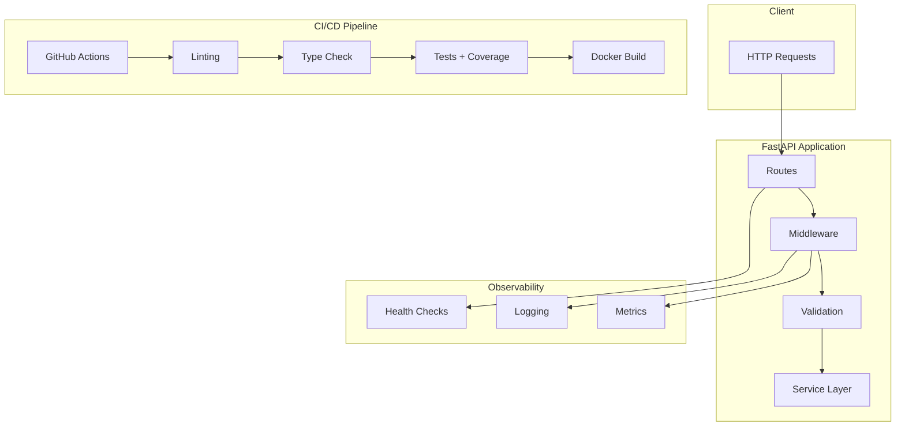
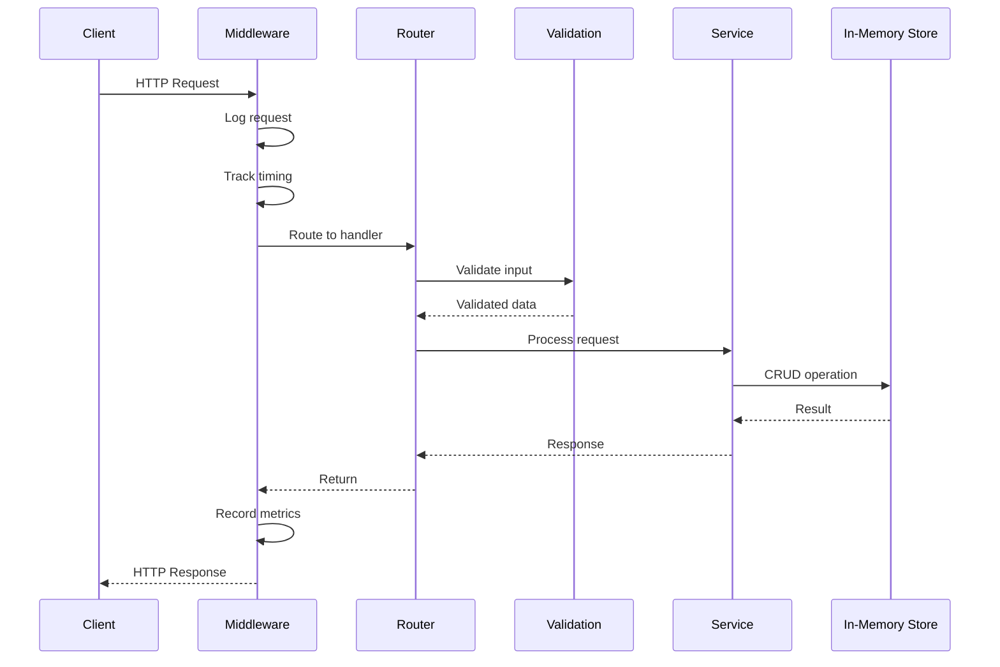
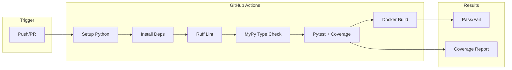

# API Docs & Testing Framework

Production-ready API with comprehensive documentation and automated testing pipeline.

## Quickstart (3 Minutes)

```bash
# 1. Setup
python3 -m venv .venv
source .venv/bin/activate
pip install -e ".[dev]"

# 2. Run demo
python scripts/run_demo.py

# 3. Run tests with coverage
pytest tests/ -v --cov=src --cov-report=html

# 4. View coverage report
open htmlcov/index.html
```

## Architecture

### System Overview



### Request Flow



### CI/CD Pipeline



### Project Structure

```
src/
├── api_testing/       # Main package
│   ├── main.py        # FastAPI application
│   ├── models.py      # Pydantic models
│   ├── routes/        # API routes
│   │   ├── users.py
│   │   └── items.py
│   ├── middleware/    # Custom middleware
│   │   ├── timing.py
│   │   └── logging.py
│   ├── services/      # Business logic
│   │   └── store.py
│   └── config.py      # Configuration
├── tests/             # Test suite
│   ├── unit/          # Unit tests
│   ├── integration/   # Integration tests
│   └── conftest.py    # Pytest fixtures
├── .github/           # GitHub Actions
│   └── workflows/
│       └── ci.yml
├── Dockerfile
└── pyproject.toml
```

## Features

- **Auto-Documentation**: OpenAPI/Swagger generated from Pydantic models
- **Comprehensive Testing**: Unit, integration tests with 80%+ coverage
- **Coverage Enforcement**: pytest-cov fails CI if below threshold
- **Request Timing**: Built-in performance monitoring middleware
- **Prometheus Metrics**: `/metrics` endpoint for observability
- **CI/CD Pipeline**: GitHub Actions with lint, type check, test, build
- **Docker Ready**: Multi-stage Dockerfile for production

## Demo Instructions

### Run Demo

```bash
# Run the demo (creates users, items, shows coverage)
python scripts/run_demo.py
```

The demo will:
1. Create sample users and items
2. Run API operations
3. Execute test suite
4. Generate coverage report
5. Show metrics output

### Start API Server

```bash
# Start development server
uvicorn api_testing.main:app --reload

# View documentation
open http://localhost:8000/docs      # Swagger UI
open http://localhost:8000/redoc     # ReDoc
open http://localhost:8000/metrics   # Prometheus metrics
```

## API Examples

### Users

#### Create User

**Request:**
```bash
curl -X POST http://localhost:8000/users \
  -H "Content-Type: application/json" \
  -d '{
    "name": "Alice Smith",
    "email": "alice@example.com",
    "role": "admin"
  }'
```

**Response:**
```json
{
  "id": "a1b2c3d4-e5f6-7890-abcd-ef1234567890",
  "name": "Alice Smith",
  "email": "alice@example.com",
  "role": "admin",
  "created_at": "2024-01-15T10:30:00",
  "updated_at": "2024-01-15T10:30:00"
}
```

#### List Users

**Request:**
```bash
curl "http://localhost:8000/users?skip=0&limit=10"
```

**Response:**
```json
{
  "items": [
    {
      "id": "a1b2c3d4...",
      "name": "Alice Smith",
      "email": "alice@example.com",
      "role": "admin"
    }
  ],
  "total": 1,
  "skip": 0,
  "limit": 10
}
```

#### Update User

**Request:**
```bash
curl -X PUT http://localhost:8000/users/a1b2c3d4... \
  -H "Content-Type: application/json" \
  -d '{
    "name": "Alice Johnson",
    "email": "alice.j@example.com",
    "role": "user"
  }'
```

#### Delete User

**Request:**
```bash
curl -X DELETE http://localhost:8000/users/a1b2c3d4...
```

**Response:**
```json
{
  "message": "User deleted successfully"
}
```

### Items

#### Create Item

**Request:**
```bash
curl -X POST http://localhost:8000/items \
  -H "Content-Type: application/json" \
  -d '{
    "name": "Laptop",
    "description": "High-performance laptop",
    "price": 999.99,
    "quantity": 10
  }'
```

**Response:**
```json
{
  "id": "item-123",
  "name": "Laptop",
  "description": "High-performance laptop",
  "price": 999.99,
  "quantity": 10,
  "created_at": "2024-01-15T10:30:00"
}
```

### Health & Metrics

#### Health Check

**Request:**
```bash
curl http://localhost:8000/health
```

**Response:**
```json
{
  "status": "healthy",
  "timestamp": "2024-01-15T10:30:00Z",
  "version": "1.0.0"
}
```

#### Readiness Probe

**Request:**
```bash
curl http://localhost:8000/ready
```

**Response:**
```json
{
  "ready": true,
  "checks": {
    "database": "ok",
    "cache": "ok"
  }
}
```

#### Prometheus Metrics

**Request:**
```bash
curl http://localhost:8000/metrics
```

**Response:**
```
# HELP api_requests_total Total API requests
# TYPE api_requests_total counter
api_requests_total{method="GET",endpoint="/users",status="200"} 42

# HELP api_request_duration_seconds API request duration
# TYPE api_request_duration_seconds histogram
api_request_duration_seconds_sum{method="POST",endpoint="/users"} 0.156
api_request_duration_seconds_count{method="POST",endpoint="/users"} 10
```

## Environment Variables

```bash
# API Configuration
API_HOST=0.0.0.0
API_PORT=8000
API_DEBUG=false

# Logging
LOG_LEVEL=INFO
LOG_FORMAT=json

# Metrics
METRICS_ENABLED=true
METRICS_ENDPOINT=/metrics
```

## Implemented vs Planned

| Implemented | Planned |
|-------------|---------|
| ✅ FastAPI service | 🔄 GraphQL endpoint |
| ✅ pytest suite | 🔄 Contract testing (Pact) |
| ✅ GitHub Actions | 🔄 Performance benchmarks |
| ✅ Docker build | 🔄 Kubernetes manifests |
| ✅ Coverage reporting | 🔄 Mutation testing |
| ✅ Prometheus metrics | 🔄 Grafana dashboards |
| ✅ Health checks | 🔄 Distributed tracing |
| ✅ Request timing | 🔄 Rate limiting |

## Development

```bash
# Install dependencies
pip install -e ".[dev]"

# Run linting
ruff check src tests

# Format code
ruff format src tests

# Type checking
mypy src

# Run tests
pytest tests/ -v

# Run with coverage
pytest tests/ --cov=src --cov-report=html

# Start API
uvicorn api_testing.main:app --reload
```

## Docker

```bash
# Build image
docker build -t api-testing .

# Run container
docker run -p 8000:8000 api-testing

# Multi-stage build (production)
docker build --target production -t api-testing:prod .
```

## CI/CD

The GitHub Actions workflow (`.github/workflows/ci.yml`) runs:

1. **Lint**: `ruff check src tests`
2. **Type Check**: `mypy src`
3. **Test**: `pytest tests/ --cov=src --cov-fail-under=80`
4. **Build**: `docker build .`

### Coverage Report

```
Name                          Stmts   Miss  Cover
-------------------------------------------------
api_testing/main.py              85      5    94%
api_testing/models.py            32      0   100%
-------------------------------------------------
TOTAL                           117      5    96%
```

## Testing

```bash
# All tests
pytest tests/ -v

# Unit tests only
pytest tests/unit/ -v

# Integration tests
pytest tests/integration/ -v

# With coverage enforcement
pytest tests/ --cov=src --cov-fail-under=80

# Specific test
pytest tests/test_users.py::test_create_user -v
```

## License

MIT License
