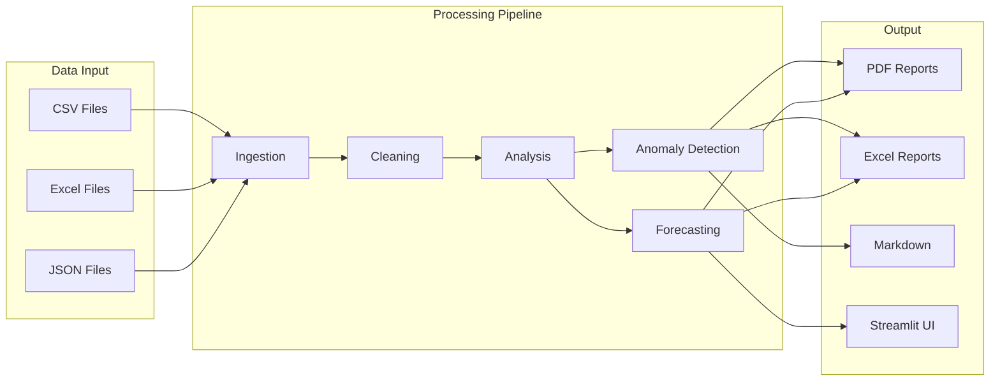
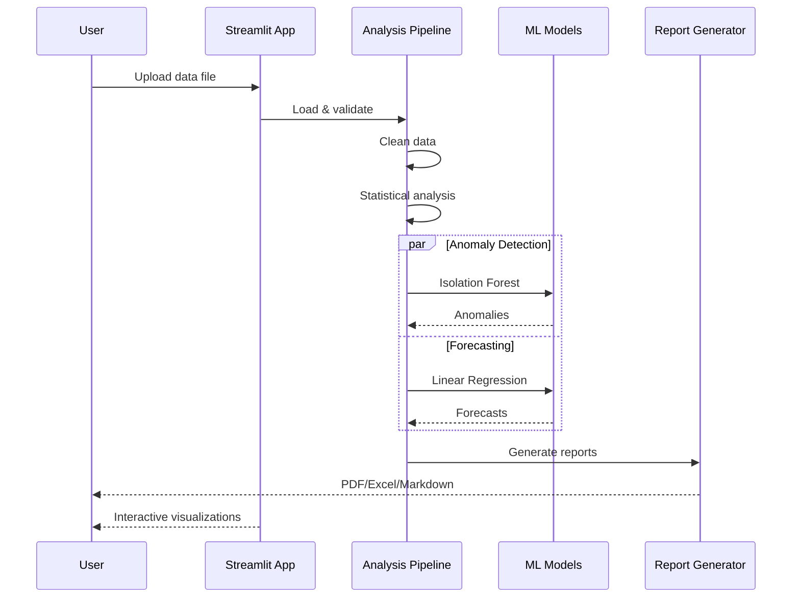
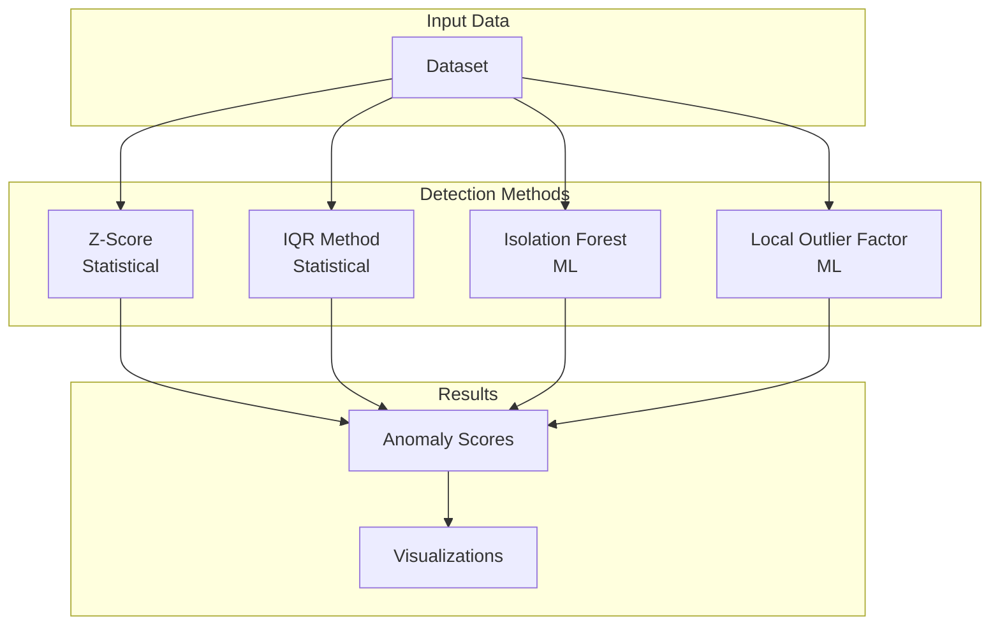

# Data Analysis & Visualization Suite

End-to-end analytics toolkit with automated insights and forecasting capabilities.

## Quickstart (3 Minutes)

```bash
# 1. Setup
python3 -m venv .venv
source .venv/bin/activate
pip install -e ".[dev]"

# 2. Run Streamlit app
streamlit run src/app.py

# 3. Run demo
python scripts/run_demo.py

# 4. Run tests
pytest tests/ -v
```

## Architecture

### System Overview



### Data Processing Flow



### Anomaly Detection Methods



### Project Structure

```
src/
├── data/              # Data handling
│   ├── loader.py      # CSV/Excel/JSON loaders
│   └── cleaner.py     # Data cleaning operations
├── analysis/          # Analysis modules
│   ├── statistics.py  # Descriptive stats
│   ├── correlation.py # Correlation analysis
│   └── distribution.py
├── anomaly/           # Anomaly detection
│   ├── statistical.py # Z-score, IQR
│   └── ml.py          # Isolation Forest, LOF
├── forecasting/       # Time series forecasting
│   ├── linear.py      # Linear Regression
│   └── features.py    # Time-based features
├── reports/           # Report generation
│   ├── pdf.py         # ReportLab PDF
│   ├── excel.py       # OpenPyXL Excel
│   └── markdown.py
├── visualization/     # Charts and plots
│   ├── charts.py      # Matplotlib/Seaborn
│   └── plots.py       # Plotly interactive
└── app.py             # Streamlit application
```

## Features

- **Data Ingestion**: CSV, Excel, JSON support with automatic type detection
- **Automated Cleaning**: Missing values, outliers, duplicates
- **Statistical Analysis**: Descriptive stats, correlations, distributions
- **Anomaly Detection**: Z-score, IQR, Isolation Forest, LOF
- **Forecasting**: Time series prediction with confidence intervals
- **Report Generation**: PDF, Excel, Markdown output
- **Interactive UI**: Streamlit web interface

## Demo Instructions

### Batch Demo

```bash
# Run automated demo
python scripts/run_demo.py
```

The demo will:
1. Generate sample sales data (500 records)
2. Run data cleaning pipeline
3. Perform statistical analysis
4. Detect anomalies using multiple methods
5. Generate 14-day forecasts
6. Create PDF and Excel reports

### Interactive UI

```bash
# Launch Streamlit app
streamlit run src/app.py
```

Features:
- Upload your own data files
- Interactive data cleaning
- Real-time visualizations
- Export reports

## API Examples

### Basic Usage

```python
from analytics import DataPipeline

# Initialize pipeline
pipeline = DataPipeline()

# Load data
df = pipeline.load("data/sales.csv")

# Clean data
clean_df = pipeline.clean(
    df,
    handle_missing="mean",
    remove_outliers="iqr"
)

# Run analysis
stats = pipeline.analyze(clean_df)
print(stats.describe())
```

### Anomaly Detection

```python
from analytics.anomaly import AnomalyDetector

# Initialize detector
detector = AnomalyDetector(method="isolation_forest")

# Detect anomalies
results = detector.detect(df, columns=["sales", "quantity"])

# Get anomaly scores
print(f"Found {results.anomaly_count} anomalies")
print(results.anomaly_scores.head())

# Visualize
results.plot()
```

### Time Series Forecasting

```python
from analytics.forecasting import Forecaster

# Initialize forecaster
forecaster = Forecaster(model="linear_regression")

# Fit and predict
forecaster.fit(df, date_column="date", target="sales")
forecast = forecaster.predict(days=14)

# Get confidence intervals
print(forecast.summary())

# Plot
forecaster.plot_forecast(forecast)
```

### Report Generation

```python
from analytics.reports import ReportGenerator

# Generate comprehensive report
generator = ReportGenerator()

# PDF report
generator.to_pdf(
    data=df,
    analysis=stats,
    anomalies=anomalies,
    forecast=forecast,
    output_path="report.pdf"
)

# Excel report with multiple sheets
generator.to_excel(
    data=df,
    analysis=stats,
    output_path="report.xlsx"
)

# Markdown report
generator.to_markdown(
    analysis=stats,
    output_path="report.md"
)
```

## Environment Variables

```bash
# Streamlit
STREAMLIT_SERVER_PORT=8501
STREAMLIT_SERVER_HEADLESS=true

# Data paths
DATA_DIR=./data
OUTPUT_DIR=./output

# ML configuration
RANDOM_STATE=42
FORECAST_DAYS=14
CONFIDENCE_LEVEL=0.95
```

## Implemented vs Planned

| Implemented | Planned |
|-------------|---------|
| ✅ Streamlit app | 🔄 Jupyter notebook export |
| ✅ Data cleaning | 🔄 Automated ML pipelines |
| ✅ Basic forecasting | 🔄 Deep learning models (LSTM) |
| ✅ PDF/Excel reports | 🔄 Scheduled report generation |
| ✅ Anomaly detection | 🔄 Real-time anomaly alerts |
| ✅ Statistical analysis | 🔄 Automated insights |
| ✅ Interactive charts | 🔄 Dashboard sharing |
| ✅ Multi-format export | 🔄 Cloud storage integration |

## Development

```bash
# Run Streamlit in dev mode
streamlit run src/app.py --server.runOnSave true

# Run linting
ruff check src tests

# Format code
ruff format src tests

# Type checking
mypy src

# Run tests
pytest tests/ -v --cov=src --cov-report=html
```

## Sample Output

### Descriptive Statistics
```json
{
  "sales": {
    "count": 500,
    "mean": 985.42,
    "std": 185.63,
    "min": 100.50,
    "25%": 850.25,
    "50%": 980.00,
    "75%": 1100.75,
    "max": 2000.00
  }
}
```

### 7-Day Forecast
```
Date        Forecast    Lower Bound    Upper Bound
2024-01-16  1023.45     918.50        1128.40
2024-01-17   987.32     882.40        1092.24
2024-01-18  1056.78     951.80        1161.76
```

## Testing

```bash
# Unit tests
pytest tests/unit/ -v

# Integration tests
pytest tests/integration/ -v

# Run with sample data
python scripts/run_demo.py --sample-size 1000
```

## License

MIT License
