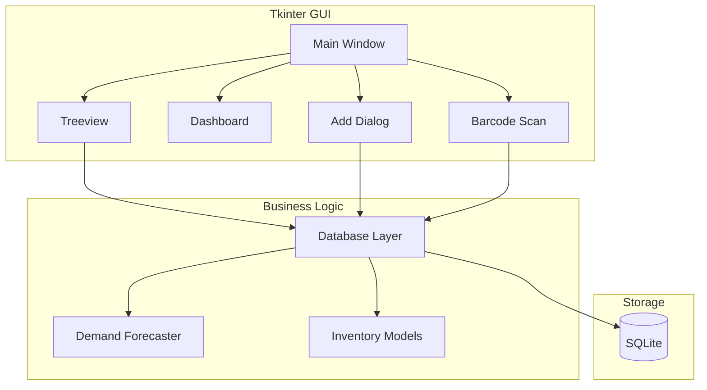
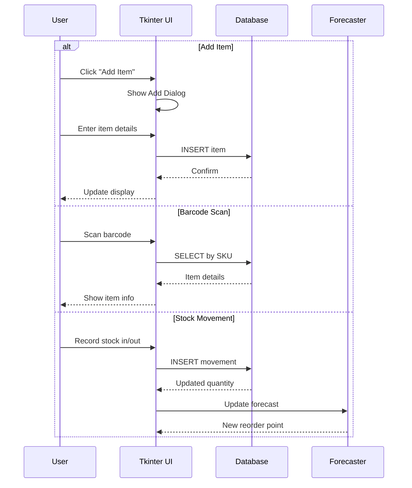
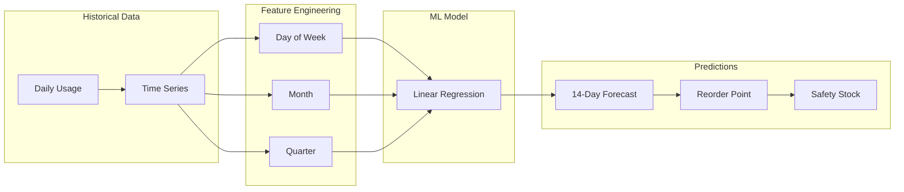

# Digital Inventory Management

Desktop inventory system with demand forecasting for restaurant operations.

## Quickstart (3 Minutes)

```bash
# 1. Setup
python3 -m venv .venv
source .venv/bin/activate
pip install -e ".[dev]"

# 2. Run GUI
python src/main.py

# 3. Run CLI demo
python scripts/run_demo.py

# 4. Run tests
pytest tests/ -v
```

## Architecture

### System Overview



### Inventory Management Flow



### Demand Forecasting



### Project Structure

```
src/
├── gui/               # Tkinter UI components
│   ├── main_window.py
│   ├── inventory_view.py
│   ├── dashboard.py
│   ├── add_item_dialog.py
│   └── barcode_dialog.py
├── models/            # Data models
│   ├── inventory.py
│   ├── movement.py
│   └── forecast.py
├── database/          # Database layer
│   ├── connection.py
│   ├── inventory_repo.py
│   └── movement_repo.py
├── forecasting/       # ML forecasting
│   ├── forecaster.py
│   └── features.py
├── services/          # Business logic
│   ├── inventory_service.py
│   └── alert_service.py
├── utils/             # Utilities
│   ├── validators.py
│   └── exporters.py
└── main.py            # Application entry
```

## Features

- **Stock Management**: Track items by SKU with quantities, units, locations
- **Movement Tracking**: Log all stock in/out transactions
- **Expiration Alerts**: Track expiry dates (database schema ready)
- **Waste Tracking**: Record waste with reasons
- **Reorder Alerts**: Visual indicators for low stock
- **Demand Forecasting**: ML-powered 14-day predictions
- **Barcode Scanning**: Simulated scanner input
- **CSV Export**: Export inventory data

## Demo Instructions

### CLI Demo

```bash
# Run CLI demo
python scripts/run_demo.py
```

The demo will:
1. Create sample inventory items (10 products)
2. Show inventory statistics
3. Generate 14-day demand forecast
4. Calculate reorder points with safety stock
5. Demonstrate CSV export

### GUI Demo

```bash
# Launch Tkinter GUI
python src/main.py
```

Features:
- View all inventory items
- Add new items
- Record stock movements
- Scan barcodes (simulated)
- View dashboard statistics
- Export to CSV

## API Examples

### Inventory Management

```python
from inventory import InventoryManager

# Initialize manager
manager = InventoryManager()

# Add new item
item = manager.add_item(
    sku="FLOUR001",
    name="All-Purpose Flour",
    category="Baking",
    quantity=50,
    unit="kg",
    reorder_level=20
)

# Record stock movement
manager.record_movement(
    sku="FLOUR001",
    quantity=-5,  # Stock out
    reference="INV-001",
    reason="Kitchen use"
)

# Get low stock alerts
alerts = manager.get_low_stock_items()
for item in alerts:
    print(f"Low stock: {item.name} ({item.quantity} {item.unit})")
```

### Demand Forecasting

```python
from inventory.forecasting import DemandForecaster

# Initialize forecaster
forecaster = DemandForecaster()

# Load historical data
history = manager.get_movement_history("FLOUR001", days=90)

# Generate forecast
forecast = forecaster.forecast(history, days=14)

# Print results
print(f"Average daily demand: {forecast.avg_daily_demand:.1f} kg")
print(f"Recommended reorder point: {forecast.reorder_point:.1f} kg")
print(f"Safety stock: {forecast.safety_stock:.1f} kg")

# Show 7-day forecast
for day in forecast.next_7_days:
    print(f"{day.date}: {day.prediction:.1f} kg")
```

### Export Data

```python
from inventory.exporters import CSVExporter

# Export all inventory
exporter = CSVExporter()
exporter.export_inventory(
    output_path="inventory.csv",
    include_stats=True
)

# Export specific category
exporter.export_by_category(
    category="Baking",
    output_path="baking_inventory.csv"
)
```

### Barcode Scanning

```python
from inventory.barcode import BarcodeScanner

# Initialize scanner
scanner = BarcodeScanner()

# Simulate scan
sku = scanner.simulate_scan("FLOUR001")

# Lookup item
item = manager.get_item_by_sku(sku)
if item:
    print(f"Found: {item.name} - {item.quantity} {item.unit}")
else:
    print("Item not found")
```

## Environment Variables

```bash
# Database
DATABASE_PATH=./inventory.db

# GUI
GUI_THEME=default
GUI_WINDOW_SIZE=1024x768

# Forecasting
FORECAST_DAYS=14
SAFETY_STOCK_DAYS=7
CONFIDENCE_LEVEL=0.95

# Alerts
LOW_STOCK_THRESHOLD=0.2  # 20% of reorder level
```

## Implemented vs Planned

| Implemented | Planned |
|-------------|---------|
| ✅ Tkinter GUI | 🔄 Web-based version |
| ✅ SQLite storage | 🔄 Cloud sync |
| ✅ Basic forecasting | 🔄 Advanced time series (ARIMA, Prophet) |
| ✅ Barcode simulation | 🔄 Hardware scanner support |
| ✅ Waste tracking | 🔄 Supplier integration |
| ✅ CSV export | 🔄 API integrations |
| ✅ Reorder alerts | 🔄 Email notifications |
| ✅ Movement tracking | 🔄 Mobile app |

## Development

```bash
# Run GUI
python src/main.py

# Run CLI demo
python scripts/run_demo.py

# Run linting
ruff check src tests

# Format code
ruff format src tests

# Type checking
mypy src

# Run tests
pytest tests/ -v --cov=src --cov-report=html
```

## Sample Data

### Inventory Items
```
SKU        Name                      Category    Qty    Unit    Reorder
FLOUR001   All-Purpose Flour         Baking      50     kg      20
SUGAR001   Granulated Sugar          Baking      30     kg      15
OIL001     Vegetable Oil             Cooking     20     L       10
RICE001    Basmati Rice              Grains      40     kg      20
PASTA001   Spaghetti                 Pasta       25     kg      15
TOM001     Canned Tomatoes           Canned      60     cans    30
CHEESE001  Mozzarella Cheese         Dairy       15     kg      8
CHICKEN001 Chicken Breast            Meat        20     kg      10
BEEF001    Ground Beef               Meat        18     kg      10
SALT001    Sea Salt                  Spices      10     kg      5
```

### Reorder Point Calculation
```
Item: FLOUR001 (All-Purpose Flour)
Average daily demand: 2.5 kg
Demand std dev: 0.8 kg
Lead time: 7 days
Lead time demand: 17.5 kg
Safety stock: 3.9 kg
Recommended reorder point: 21.4 kg
```

### 7-Day Forecast
```
Date        Forecast (kg)
2024-01-16  2.3
2024-01-17  2.8
2024-01-18  2.1
2024-01-19  3.2
2024-01-20  2.9
2024-01-21  3.5
2024-01-22  2.6
```

## Testing

```bash
# Unit tests
pytest tests/unit/ -v

# Integration tests
pytest tests/integration/ -v

# GUI tests (requires display)
pytest tests/gui/ -v

# With coverage
pytest tests/ --cov=src --cov-report=html
```

## License

MIT License
